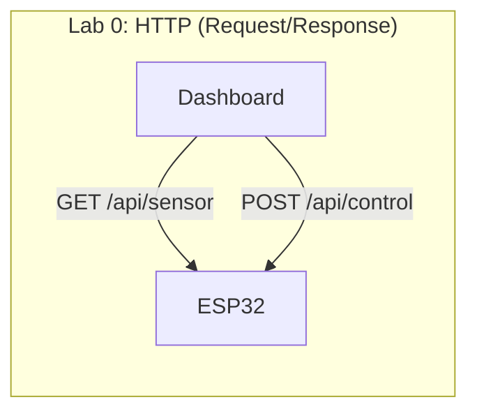
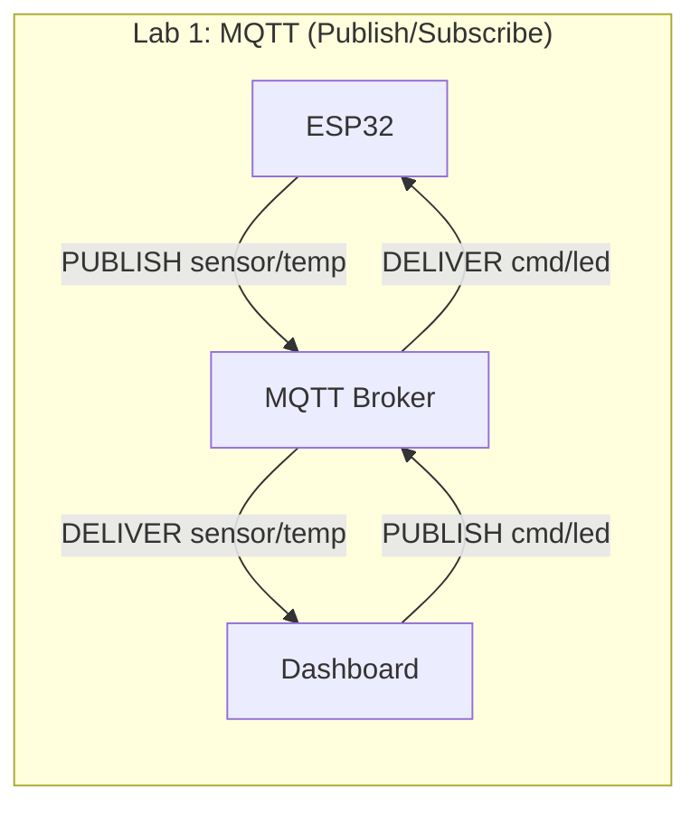
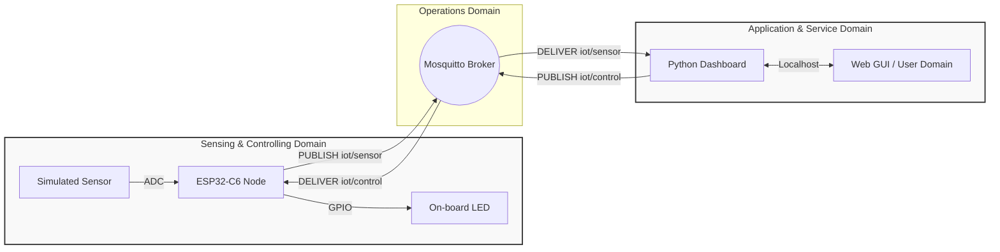
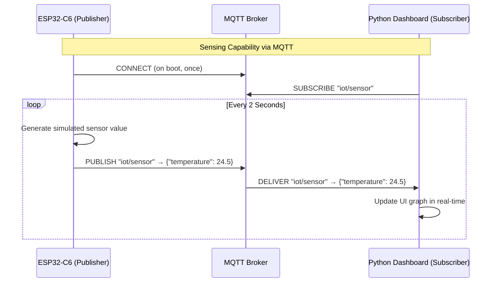
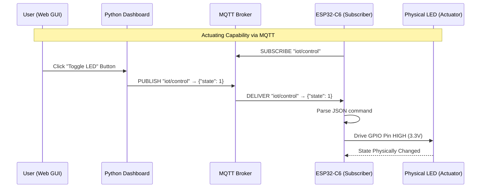

# Lecture 2: Minimal IoT Implementation — MQTT

**Course:** IoT Systems Design
**Target Hardware:** ESP32-C6 (Wi-Fi 6, Bluetooth 5, Zigbee/Thread)
**Target Software:** Python (`tools/dashboard_mqtt.py`)
**Standard Reference:** ISO/IEC 30141:2024
**Prerequisite:** Lab 0 (HTTP version) completed

---

## Introduction

* **Objective:** Rebuild the same Sensing + Actuating IoT system from Lab 0 using **MQTT** instead of HTTP, and understand how the choice of application protocol fundamentally changes the system architecture.
* **Core Technologies:** ESP32-C6, Python, MQTT (Mosquitto broker), `paho-mqtt`.

---

## HTTP vs MQTT: Why a Different Protocol?

In Lab 0 we used HTTP — a **request/response** protocol where the dashboard must actively poll the ESP32 for sensor data. This works, but it has architectural implications that become problematic at scale.

| Aspect | HTTP (Lab 0) | MQTT (Lab 1) |
|---|---|---|
| **Pattern** | Request/Response (Client/Server) | Publish/Subscribe (Broker-mediated) |
| **Transport** | TCP port 80 | TCP port 1883 |
| **Who initiates?** | Dashboard polls ESP32 | ESP32 pushes data to broker |
| **Overhead per message** | ~200-800 bytes (HTTP headers) | ~2 bytes (fixed header) |
| **ESP32 role** | Server (listens for connections) | Client (connects outward to broker) |
| **Scalability** | Dashboard must poll each node individually | Broker fans out to all subscribers |
| **Firewall/NAT friendly** | No — ESP32 must accept inbound connections | Yes — ESP32 only makes outbound connections |

### The Architectural Shift

In Lab 0, the **ESP32 was a server** — it listened on port 80 and waited for the dashboard to request data. This is conceptually simple but creates several problems:
- The dashboard must know every node's IP address
- Nodes behind NAT or firewalls cannot be reached
- Polling wastes bandwidth when there is no new data
- Adding a new dashboard/consumer requires changes to the ESP32

With MQTT, **both the ESP32 and the dashboard are clients** that connect to a central **broker**. The ESP32 *publishes* data, and the dashboard *subscribes* to it. Neither needs to know the other's IP address.





---

## MQTT Fundamentals
*The Publish/Subscribe Model*

### Topics

MQTT organizes messages by **topics** — hierarchical strings separated by `/`. There are no predefined endpoints like HTTP URIs; any client can publish or subscribe to any topic.

For our lab, we will use:
- **`iot/sensor`** — ESP32 publishes sensor telemetry here
- **`iot/control`** — Dashboard publishes LED commands here

### Quality of Service (QoS)

MQTT provides three delivery guarantees:
- **QoS 0:** At most once (fire and forget) — suitable for frequent sensor readings
- **QoS 1:** At least once (acknowledged delivery) — suitable for control commands
- **QoS 2:** Exactly once (four-step handshake) — rarely needed

### The Broker

The broker is the central relay. Every MQTT message passes through the broker. For this lab we use **Mosquitto**, an open-source MQTT broker that can run locally on your computer.

---

## The Architecture of Lab 1
*Mapping the SCD to the ASD via MQTT*

* **Sensing and Controlling Domain (SCD):** The ESP32-C6 — now a *publisher* of sensor data and a *subscriber* to control commands.
* **Application and Service Domain (ASD):** The Python dashboard — now a *subscriber* to sensor data and a *publisher* of control commands.
* **Operations Domain:** The MQTT broker (Mosquitto), routing messages between domains.



---

## Exercise Step 0: Install the MQTT Broker
*Setting Up the Operations Domain*

**Objective:** Provision the message broker that will route all MQTT traffic.

**Action:** Install and start Mosquitto on your workstation.

### Windows

1. Download the Mosquitto installer from [mosquitto.org/download](https://mosquitto.org/download/) (choose the **Win64** `.exe` installer).
2. Run the installer. When prompted, check the option to **install as a service**.
3. After installation, Mosquitto's default directory is `C:\Program Files\mosquitto\`.

**Configure for local network access:** By default, Mosquitto 2.x only accepts connections from `localhost`. We need to allow connections from the ESP32 on the Wi-Fi network.

Open `C:\Program Files\mosquitto\mosquitto.conf` in a text editor (run as Administrator) and add these two lines at the end:

```
listener 1883
allow_anonymous true
```

**Start/Restart the service:**
```cmd
:: Open a Command Prompt as Administrator
net stop mosquitto
net start mosquitto
```

> **Alternative:** You can also start/stop the service from the Windows Services panel (`services.msc`), look for "Mosquitto Broker".

**Quick Test:** Open **two** Command Prompt windows:
```cmd
:: Terminal 1: Subscribe
"C:\Program Files\mosquitto\mosquitto_sub" -h localhost -t "test/hello"

:: Terminal 2: Publish
"C:\Program Files\mosquitto\mosquitto_pub" -h localhost -t "test/hello" -m "Hello from MQTT!"
```

You should see the message appear in Terminal 1. This confirms the broker is working.

> **Firewall:** If the ESP32 cannot connect to the broker, ensure Windows Firewall allows inbound connections on **TCP port 1883**. You can add a rule via: *Windows Defender Firewall → Advanced Settings → Inbound Rules → New Rule → Port → TCP 1883 → Allow*.

### Linux (Ubuntu/Debian)

```bash
# Ubuntu/Debian
sudo apt install mosquitto mosquitto-clients

# Verify it is running
systemctl status mosquitto
```

Mosquitto will listen on `localhost:1883` by default. For this lab, we need it to accept anonymous connections on the local network. Create or edit `/etc/mosquitto/conf.d/lab.conf`:

```
listener 1883
allow_anonymous true
```

Then restart the service:
```bash
sudo systemctl restart mosquitto
```

**Quick Test:** Open two terminals and verify the broker works:
```bash
# Terminal 1: Subscribe
mosquitto_sub -h localhost -t "test/hello"

# Terminal 2: Publish
mosquitto_pub -h localhost -t "test/hello" -m "Hello from MQTT!"
```

You should see the message appear in Terminal 1. This confirms the broker is working.

---

## Exercise Step 1: Launching the Application Domain
*Running the MQTT Dashboard*

**Objective:** Initialize the Application and Service Domain (ASD).

**Action:** Install the Python dependency and run the dashboard.

```bash
pip install paho-mqtt flask
python tools/dashboard_mqtt.py
```

```bash
~/Documents/4201327-IoT_Systems_Design_Labs/tools$ python3 dashboard_mqtt.py
[*] MQTT Dashboard running.
[*] Broker: localhost:1883
[*] Subscribed to: iot/sensor
[*] Publishing control to: iot/control
 * Serving Flask app 'dashboard_mqtt'
 * Debug mode: off
```

> **Note:** Unlike the HTTP dashboard, this dashboard does **not** need the ESP32's IP address. It only needs the broker's address. The ESP32 and dashboard discover each other through shared topic names.

---

## Exercise Step 2: Sensing Implementation
*Push-Based Telemetry*

**Objective:** Implement a Sensing Capability using MQTT PUBLISH.

**Action:** Flash the ESP32-C6 to periodically publish sensor data to the broker.

**Key difference from HTTP:** The ESP32 no longer waits for the dashboard to request data. Instead, it **pushes** new readings at its own cadence.



Compare this to Lab 0 where the dashboard had to send an HTTP GET every 1.5 seconds. Here, the data flows in the opposite direction — from sensor to consumer, which is the natural direction for telemetry.

---

## Exercise Step 3: Actuating Implementation
*Command Delivery via Subscribe*

**Objective:** Implement an Actuating Capability using MQTT PUBLISH/SUBSCRIBE.

**Action:** Toggle the on-board LED from the dashboard UI.



> **Notice:** There is no HTTP response or acknowledgment from the ESP32. In MQTT, the publisher (dashboard) does not know if the subscriber (ESP32) received the message unless it explicitly publishes a confirmation back on another topic. This is a fundamental difference from the HTTP request/response model. For QoS 1+, the *broker* acknowledges receipt, but that only confirms the broker got it — not the end device.

---

## ESP32-C6 Firmware: From HTTP Server to MQTT Client

### Overview of Changes

The firmware changes from Lab 0 to Lab 1 reflect the architectural shift:

| Component | HTTP (Lab 0) | MQTT (Lab 1) |
|---|---|---|
| **ESP-IDF example base** | `protocols/http_server/simple` | `protocols/mqtt/tcp` |
| **Main include** | `esp_http_server.h` | `mqtt_client.h` |
| **Server/Client** | `httpd_start()` — starts a server | `esp_mqtt_client_start()` — connects as client |
| **Sensing** | Handler waits for GET request | Task publishes on a timer |
| **Actuating** | Handler waits for POST request | Callback fires on incoming message |
| **CMake requires** | `esp_http_server json driver` | `mqtt json driver` |

### 0. Project Setup

Copy the MQTT TCP example from ESP-IDF to your workspace:

```bash
cp -r $IDF_PATH/examples/protocols/mqtt/tcp mqtt_simple
cd mqtt_simple
```

Open `menuconfig` and configure:
1. **Wi-Fi credentials:** `Example Connection Configuration` → set SSID and Password
2. **Broker URL:** `Example Configuration` → set `Broker URL` to `mqtt://YOUR_PC_IP:1883`

> **Important:** Use your computer's IP address on the Wi-Fi network (e.g., `mqtt://192.168.1.50:1883`), not `localhost` — the ESP32 needs to reach your computer over the network.

### 1. Build System Setup

**`main/CMakeLists.txt`** — add `json` and `driver` to the requires list:
```cmake
idf_component_register(SRCS "app_main.c"
                    PRIV_REQUIRES mqtt nvs_flash esp_netif json driver
                    INCLUDE_DIRS ".")
```

### 2. Required Includes & Definitions

Replace the contents of `main/app_main.c` with the following. Add these at the top:

```c
#include <stdio.h>
#include <stdint.h>
#include <string.h>
#include <stdlib.h>
#include <inttypes.h>
#include "esp_system.h"
#include "nvs_flash.h"
#include "esp_event.h"
#include "esp_netif.h"
#include "protocol_examples_common.h"
#include "esp_log.h"
#include "mqtt_client.h"

#include "cJSON.h"
#include "driver/gpio.h"
#include "esp_random.h"

// Define the onboard LED pin for the ESP32-C6
#define BLINK_GPIO 8

// MQTT Topics
#define TOPIC_SENSOR  "iot/sensor"
#define TOPIC_CONTROL "iot/control"

static const char *TAG = "mqtt_iot";
static esp_mqtt_client_handle_t mqtt_client = NULL;
```

### 3. Actuating Capability — MQTT Message Handler

In the HTTP version, we had an `httpd_req_t` handler that parsed a POST body. In MQTT, we receive messages through an **event callback**. Add this function:

```c
static void handle_control_message(const char *data, int data_len)
{
    // Null-terminate the incoming data for safe parsing
    char buf[64];
    int len = data_len < (int)sizeof(buf) - 1 ? data_len : (int)sizeof(buf) - 1;
    memcpy(buf, data, len);
    buf[len] = '\0';

    cJSON *root = cJSON_Parse(buf);
    if (root != NULL) {
        cJSON *state_item = cJSON_GetObjectItem(root, "state");
        if (state_item != NULL && cJSON_IsNumber(state_item)) {
            int state = state_item->valueint;
            gpio_set_level(BLINK_GPIO, state);
            ESP_LOGI(TAG, "Actuating Command Received. LED State: %d", state);
        }
        cJSON_Delete(root);
    }
}
```

### 4. MQTT Event Handler

This replaces the HTTP URI registration model. Instead of registering separate handler functions for each endpoint, we handle all MQTT events in a single callback:

```c
static void mqtt_event_handler(void *handler_args, esp_event_base_t base,
                                int32_t event_id, void *event_data)
{
    esp_mqtt_event_handle_t event = event_data;
    esp_mqtt_client_handle_t client = event->client;

    switch ((esp_mqtt_event_id_t)event_id) {
    case MQTT_EVENT_CONNECTED:
        ESP_LOGI(TAG, "Connected to MQTT broker");
        // Subscribe to the control topic (like registering a POST handler in HTTP)
        esp_mqtt_client_subscribe(client, TOPIC_CONTROL, 1);
        ESP_LOGI(TAG, "Subscribed to: %s", TOPIC_CONTROL);
        break;

    case MQTT_EVENT_DATA:
        ESP_LOGI(TAG, "Received message on: %.*s", event->topic_len, event->topic);
        // Route message to the appropriate handler (like URI dispatching in HTTP)
        if (strncmp(event->topic, TOPIC_CONTROL, event->topic_len) == 0) {
            handle_control_message(event->data, event->data_len);
        }
        break;

    case MQTT_EVENT_DISCONNECTED:
        ESP_LOGW(TAG, "Disconnected from MQTT broker");
        break;

    case MQTT_EVENT_ERROR:
        ESP_LOGE(TAG, "MQTT error occurred");
        break;

    default:
        break;
    }
}
```

### 5. Sensing Capability — Publish Task

In the HTTP version, sensor data was only sent when the dashboard requested it (pull model). In MQTT, we use a FreeRTOS task that **pushes** data at a fixed interval:

```c
static void sensor_publish_task(void *pvParameters)
{
    while (1) {
        if (mqtt_client != NULL) {
            // Generate a dummy temperature between 20.0 and 29.9
            float temp = 20.0f + (esp_random() % 100) / 10.0f;

            char buffer[64];
            snprintf(buffer, sizeof(buffer), "{\"temperature\": %.1f}", temp);

            esp_mqtt_client_publish(mqtt_client, TOPIC_SENSOR, buffer, 0, 0, 0);
            ESP_LOGI(TAG, "Published: %s -> %s", TOPIC_SENSOR, buffer);
        }
        vTaskDelay(pdMS_TO_TICKS(2000)); // Publish every 2 seconds
    }
}
```

### 6. Main Application

Replace `app_main` entirely:

```c
void app_main(void)
{
    ESP_LOGI(TAG, "[APP] Startup..");
    ESP_LOGI(TAG, "[APP] Free memory: %" PRIu32 " bytes", esp_get_free_heap_size());

    ESP_ERROR_CHECK(nvs_flash_init());
    ESP_ERROR_CHECK(esp_netif_init());
    ESP_ERROR_CHECK(esp_event_loop_create_default());

    // Initialize Actuator Hardware (LED) — same as Lab 0
    gpio_reset_pin(BLINK_GPIO);
    gpio_set_direction(BLINK_GPIO, GPIO_MODE_OUTPUT);
    gpio_set_level(BLINK_GPIO, 0);

    // Connect to Wi-Fi — same as Lab 0
    ESP_ERROR_CHECK(example_connect());

    // Configure and start MQTT client
    esp_mqtt_client_config_t mqtt_cfg = {
        .broker.address.uri = CONFIG_BROKER_URL,
    };
    mqtt_client = esp_mqtt_client_init(&mqtt_cfg);
    esp_mqtt_client_register_event(mqtt_client, ESP_EVENT_ANY_ID, mqtt_event_handler, NULL);
    esp_mqtt_client_start(mqtt_client);

    // Start the sensor publishing task
    xTaskCreate(sensor_publish_task, "sensor_pub", 4096, NULL, 5, NULL);
}
```

---

## System Integration & Verification

### Step 1: Start the Broker

Ensure Mosquitto is running on your workstation:
```bash
systemctl status mosquitto
```

### Step 2: Configure and Flash the ESP32

1. Set the broker URL in `menuconfig`:
   ```bash
   idf.py menuconfig
   # Example Configuration → Broker URL: mqtt://YOUR_PC_IP:1883
   # Example Connection Configuration → Wi-Fi SSID and Password
   ```
2. Build and flash:
   ```bash
   idf.py build flash monitor
   ```
3. You should see output like:
   ```
   I (3456) mqtt_iot: Connected to MQTT broker
   I (3456) mqtt_iot: Subscribed to: iot/control
   I (5456) mqtt_iot: Published: iot/sensor -> {"temperature": 24.3}
   ```

### Step 3: Verify with Command-Line Tools (Optional)

Before launching the dashboard, you can verify traffic with `mosquitto_sub`:
```bash
# Watch sensor data flowing from the ESP32
mosquitto_sub -h localhost -t "iot/sensor"

# Send a control command manually
mosquitto_pub -h localhost -t "iot/control" -m '{"state": 1}'
```

### Step 4: Launch the Dashboard

```bash
python tools/dashboard_mqtt.py
```

Open `http://localhost:5000` in your browser.

### Step 5: Verify Capabilities

* **Sensing Capability:** The telemetry graph should update automatically as the ESP32 publishes data. Unlike Lab 0, the dashboard is **not polling** — it receives data instantly when the ESP32 publishes.
* **Actuating Capability:** Click "Turn ON" / "Turn OFF". The dashboard publishes to `iot/control`, the broker delivers it to the ESP32, and the LED changes state.

---

## Discussion: HTTP vs MQTT Trade-offs

After completing both labs, consider these questions:

1. **Direction of data flow:** In HTTP, who initiates the sensor data transfer? In MQTT? Which matches the natural flow of telemetry data?

2. **Coupling:** In HTTP, the dashboard needs the ESP32's IP address. In MQTT, what does each party need to know? What happens if you add a second ESP32 node?

3. **Scalability:** If you had 100 sensor nodes, how would the HTTP dashboard cope vs. the MQTT dashboard?

4. **Reliability:** What happens in each protocol if the dashboard goes offline for 30 seconds and comes back? Does it miss data? Can MQTT's QoS and retained messages help?

5. **Overhead:** Use Wireshark to capture traffic from both labs. Compare the packet sizes for a single sensor reading delivery.

6. **Security:** Neither lab uses encryption. What would be needed for each? (HTTPS/TLS vs MQTTS/TLS)
