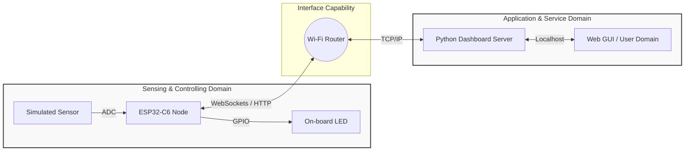

# Lecture 1: Minimal IoT Implementation and Architecture

**Course:** IoT Systems Design  
**Target Hardware:** ESP32-C6 (Wi-Fi 6, Bluetooth 5, Zigbee/Thread)  
**Target Software:** Python (`tools/dashboard.py`)  
**Standard Reference:** ISO/IEC 30141:2024  

---

## Introduction to Lab 0: Minimal IoT Implementation

* **Objective:** To understand the fundamental architectural principles of IoT as defined by **ISO/IEC 30141:2024** and successfully build a minimal IoT system mapping physical hardware to a digital application interface.
* **Core Technologies:** ESP32-C6 Microcontroller, Python, WebSockets/HTTP.

---

## Slide 2: What is an IoT System? 
*Defining the Paradigm (ISO/IEC 30141:2024)*

* **The Conceptual Shift:** An embedded device is not inherently an IoT device.
* **1. A Many-to-Many Digital Network:** The system must utilize network capabilities that support routing beyond simple point-to-point connections.
* **2. Physical World Interaction:** The system must possess at least one component that interacts with the physical world through **sensing** or **actuating**.


---

## Slide 3: The IoT Component Pattern
*Deconstructing the Node (§6.7.3)*

* In our lab, the **ESP32-C6** functions as a single **Component**. According to the standard, an IoT Component is defined by five categories of capabilities:
    1. **Transducer Capabilities:** Bridging the physical and digital (Sensing/Actuating).
    2. **Data Capabilities:** Processing, storing, and transferring data locally.
    3. **Interface Capabilities:** Connecting to networks, applications, and human users.
    4. **Supporting Capabilities:** Device management, security, and identity.
    5. **Latent Capabilities:** Potential functions not currently active or provisioned.


---

## Slide 4: Transducer Capabilities: Sensing vs. Actuating
*The Bridge Between Digital and Physical*

* **Sensing Capability:** Acquiring information from the physical world and converting it into a digital representation (Analog-to-Digital).
* **Actuating Capability:** Converting digital commands into physical actions, altering the state of the physical world (Digital-to-Analog / PWM / GPIO).
* **The IoT Core Loop:** The constant interplay between data collection and system response.


---

## Slide 5: Interface Capabilities
*Why a 'Network Interface' is Mandatory*

* **Network Interface Capability:** Dictates how the device connects to the **many-to-many digital network** (e.g., 802.11 Wi-Fi).
* **Application Interface Capability:** How the component exposes its data and services to software (e.g., RESTful APIs, MQTT).
* **Human User Interface Capability:** Direct human interaction (e.g., physical buttons, local displays).


---

## Slide 6: The Architecture of Lab 1
*Mapping the SCD to the ASD*

* **Sensing and Controlling Domain (SCD):** The ESP32-C6 gathering data and executing commands.
* **Application and Service Domain (ASD):** The Python-based dashboard providing logic and visualization.
* **The Goal:** Establish reliable, bidirectional communication.



## Slide 7: Exercise Step 1: Launching the Application Domain
*Running the Dashboard*

**Objective:** Initialize the Application and Service Domain (ASD).

**Action:** Execute python tools/dashboard.py on your workstation.

**Under the Hood:** Spins up a local server and provisions an Application Interface Capability listening for edge devices.

```bash
~/Documents/4201327-IoT_Systems_Design_Labs/tools$ python3 dashboard.py 
===================================================
 Thread/CoAP Dashboard Initialized
 Target Edge Node IP: fd11:22:33:0:0:0:0:1
 Listening on: http://0.0.0.0:5000/
===================================================

 * Serving Flask app 'dashboard'
 * Debug mode: on
===================================================
 Thread/CoAP Dashboard Initialized
 Target Edge Node IP: fd11:22:33:0:0:0:0:1
 Listening on: http://0.0.0.0:5000/
===================================================
```

## Slide 8: Exercise Step 2: Sensing Implementation
Simulating Telemetry

Objective: Implement a Sensing Capability.

Action: Flash the ESP32-C6 to transmit continuous dummy data.

Code snippet
sequenceDiagram
    participant S as ESP32-C6 (Transducer)
    participant N as Wi-Fi Network (Interface)
    participant D as Python Dashboard (ASD)
    
    Note over S, D: Sensing Capability Implementation
    
    loop Every 1 Second
        S->>S: Generate simulated sensor value
        S->>N: Format payload (JSON)
        N->>D: POST /telemetry {"temp": 24.5}
        D-->>N: 200 OK
        D->>D: Parse data & update UI graph
    end
Instructor Notes:
Emphasize the asynchronous loop. The ESP32 is initiating the connection. Show them the structure of the JSON payload. We simulate the data first so we can isolate networking bugs from hardware/wiring bugs.

Slide 9: Exercise Step 3: Actuating Implementation
Closing the Control Loop

Objective: Implement an Actuating Capability.

Action: Toggle the on-board LED from the dashboard UI.

Code snippet
sequenceDiagram
    participant U as User (Web GUI)
    participant D as Python Dashboard (ASD)
    participant N as Wi-Fi Network (Interface)
    participant E as ESP32-C6 (Data Capability)
    participant L as Physical LED (Actuator)
    
    Note over U, L: Actuating Capability Implementation
    
    U->>D: Click "Toggle LED" Button
    D->>N: POST /command {"led_state": "ON"}
    N->>E: Route packet to ESP32-C6 IP
    E->>E: Parse JSON command
    E->>L: Drive GPIO Pin HIGH (3.3V)
    L-->>E: State Physically Changed
    E-->>N: 200 OK (Acknowledgment)
    N-->>D: Route Acknowledgment
    D-->>U: Update UI Toggle Color (Green)
Instructor Notes:
Contrast this with the previous slide. Here, the User Domain initiates the action, and the command flows downstream to the hardware. Highlighting the 200 OK acknowledgment is crucial; in robust IoT systems, we never assume a physical state changed without confirmation from the edge.

Slide 10: Summary: Completing the Loop from Physical to Digital
What We Built: A standard-compliant, minimal IoT system.

Theoretical Proof: Demonstrated a many-to-many network interacting with the physical world.

Architectural Proof: Successfully mapped data flow between the SCD and the ASD.

Next Steps for Lab 2: Transitioning from simulated telemetry to real analog sensors and implementing secure payload structures.

Instructor Notes:
Wrap up by congratulating them on building an end-to-end system. Remind them to commit their code to their own forks of the lab repository before leaving.