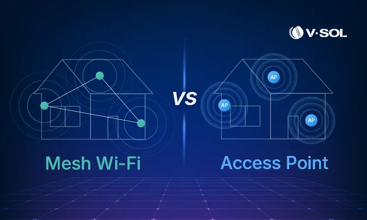
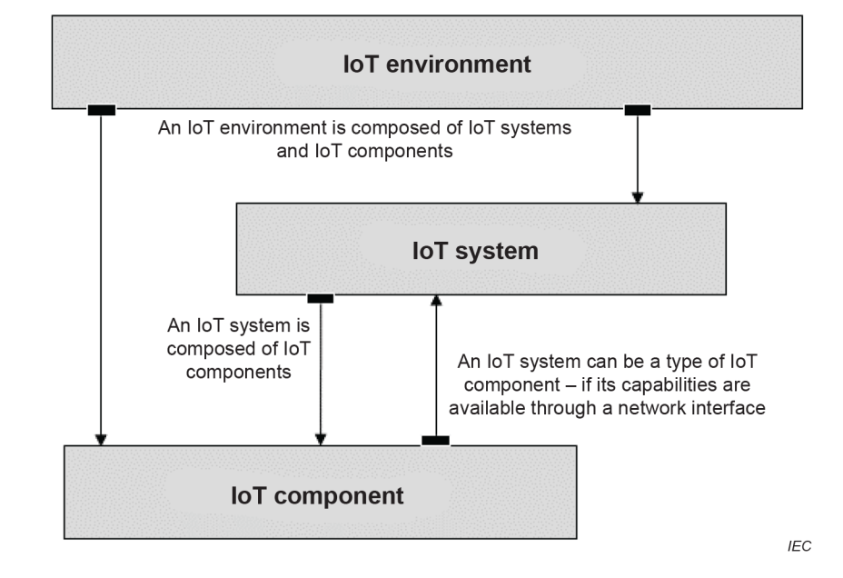
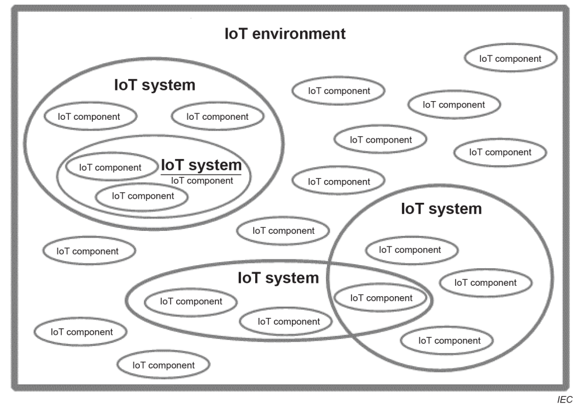
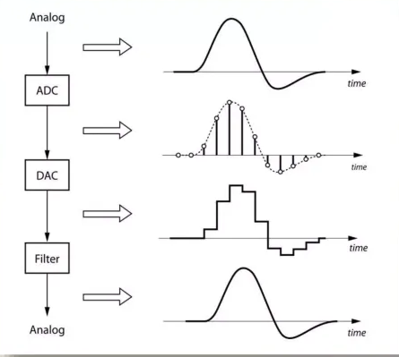
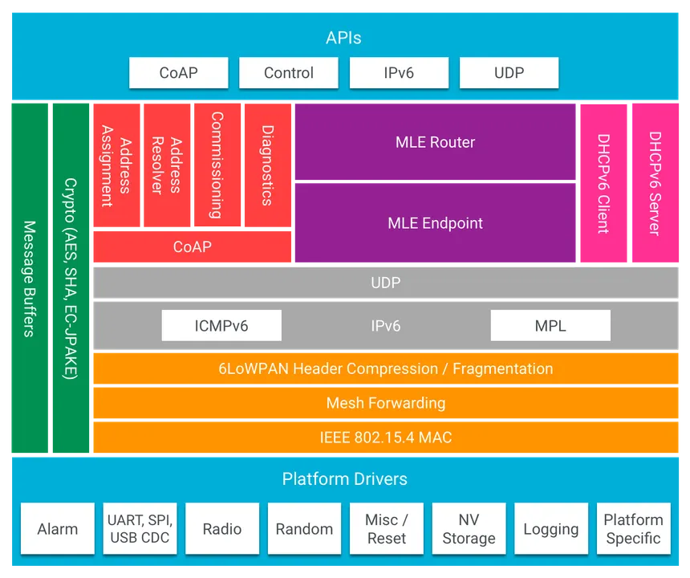
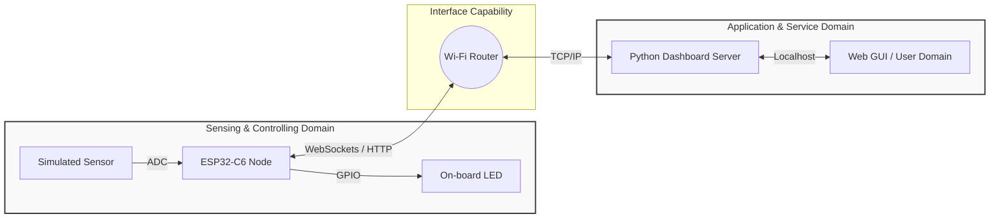
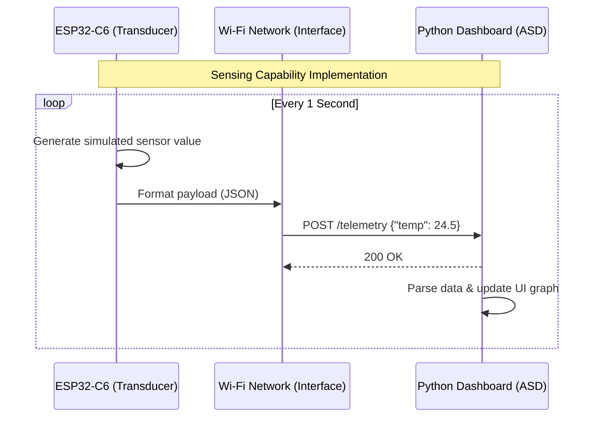
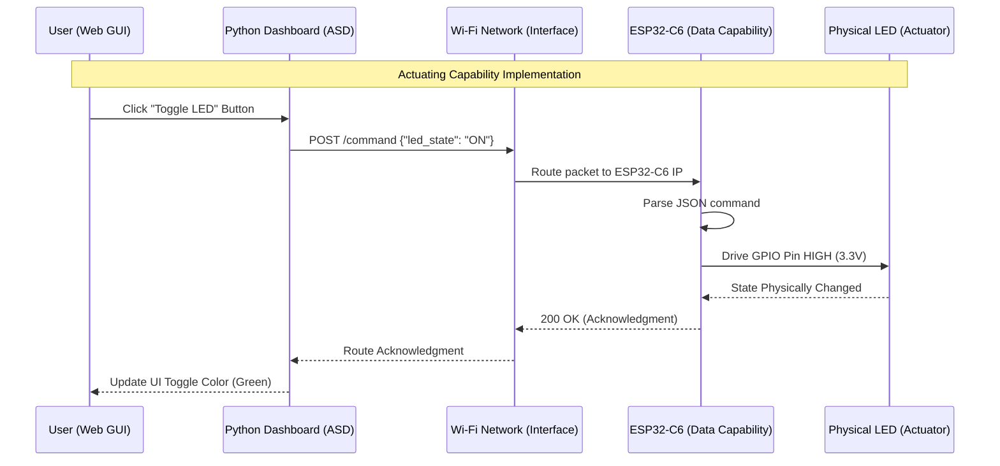

# Lecture 1: Minimal IoT Implementation and Architecture

**Course:** IoT Systems Design  
**Target Hardware:** ESP32-C6 (Wi-Fi 6, Bluetooth 5, Zigbee/Thread)  
**Target Software:** Python (`tools/dashboard.py`)  
**Standard Reference:** ISO/IEC 30141:2024  

---

## Introduction to Lab 0: Minimal IoT Implementation

* **Objective:** To understand the fundamental architectural principles of IoT as defined by **ISO/IEC 30141:2024** and successfully build a minimal IoT system mapping physical hardware to a digital application interface.
* **Core Technologies:** ESP32-C6 Microcontroller, Python, WebSockets/HTTP.

---

## What is an IoT System? 
*Defining the Paradigm (ISO/IEC 30141:2024)*

* **The Conceptual Shift:** An embedded device is not inherently an IoT device.
* **1. A Many-to-Many Digital Network:** The system must utilize network capabilities that support routing beyond simple point-to-point connections.
* **2. Physical World Interaction:** The system must possess at least one component that interacts with the physical world through **sensing** or **actuating**.



---

## The IoT Component Pattern
*Deconstructing the Node (§6.7.3)*

* In our lab, the **ESP32-C6** functions as a single **Component**. According to the standard, an IoT Component is defined by five categories of capabilities:
    1. **Transducer Capabilities:** Bridging the physical and digital (Sensing/Actuating).
    2. **Data Capabilities:** Processing, storing, and transferring data locally.
    3. **Interface Capabilities:** Connecting to networks, applications, and human users.
    4. **Supporting Capabilities:** Device management, security, and identity.
    5. **Latent Capabilities:** Potential functions not currently active or provisioned.




---

## Transducer Capabilities: Sensing vs. Actuating
*The Bridge Between Digital and Physical*

* **Sensing Capability:** Acquiring information from the physical world and converting it into a digital representation (Analog-to-Digital).
* **Actuating Capability:** Converting digital commands into physical actions, altering the state of the physical world (Digital-to-Analog / PWM / GPIO).
* **The IoT Core Loop:** The constant interplay between data collection and system response.




---

## Interface Capabilities
*Why a 'Network Interface' is Mandatory*

* **Network Interface Capability:** Dictates how the device connects to the **many-to-many digital network** (e.g., 802.11 Wi-Fi).
* **Application Interface Capability:** How the component exposes its data and services to software (e.g., RESTful APIs, MQTT).
* **Human User Interface Capability:** Direct human interaction (e.g., physical buttons, local displays).



---

## The Architecture of Lab 1
*Mapping the SCD to the ASD*

* **Sensing and Controlling Domain (SCD):** The ESP32-C6 gathering data and executing commands.
* **Application and Service Domain (ASD):** The Python-based dashboard providing logic and visualization.
* **The Goal:** Establish reliable, bidirectional communication.



## Exercise Step 1: Launching the Application Domain
*Running the Dashboard*

**Objective:** Initialize the Application and Service Domain (ASD).

**Action:** Execute python tools/dashboard.py on your workstation.

**Under the Hood:** Spins up a local server and provisions an Application Interface Capability listening for edge devices.

```bash
~/Documents/4201327-IoT_Systems_Design_Labs/tools$ python3 dashboard.py 
===================================================
 Thread/CoAP Dashboard Initialized
 Target Edge Node IP: fd11:22:33:0:0:0:0:1
 Listening on: http://0.0.0.0:5000/
===================================================

 * Serving Flask app 'dashboard'
 * Debug mode: on
===================================================
 Thread/CoAP Dashboard Initialized
 Target Edge Node IP: fd11:22:33:0:0:0:0:1
 Listening on: http://0.0.0.0:5000/
===================================================
```

## Exercise Step 2: Sensing Implementation
Simulating Telemetry

**Objective:** Implement a Sensing Capability.

**Action:** Flash the ESP32-C6 to transmit continuous dummy data.



## Exercise Step 3: Actuating Implementation
*Closing the Control Loop*

**Objective:** Implement an Actuating Capability.

**Action:** Toggle the on-board LED from the dashboard UI.



## ESP32-C6 Firmware Code Modifications

The following code modifications must be made to `main/main.c` to implement the Sensing and Actuating capabilities for Lab 0.

### 0. Build System Setup

**`main/CMakeLists.txt`** — add `json` and `driver` to the requires list:
```cmake
set(requires esp-tls nvs_flash esp_netif esp_http_server json driver)
```

### 1. Required Includes & Definitions
Add these to the top of the file, below the existing `#include` statements.

```c
#include "cJSON.h"
#include "driver/gpio.h"
#include "esp_random.h"

// Define the onboard LED pin for the ESP32-C6
#define BLINK_GPIO 8

```

### 2. Sensing and Actuating Handlers

Add these functions directly above the `start_webserver(void)` function.

```c
/* ---------------------------------------------------
 * SENSING CAPABILITY (GET /api/sensor)
 * --------------------------------------------------- */
static esp_err_t sensor_get_handler(httpd_req_t *req)
{
    // Generate a dummy temperature between 20.0 and 29.9
    float temp = 20.0 + (esp_random() % 100) / 10.0;
    
    // Format as JSON
    char buffer[100];
    snprintf(buffer, sizeof(buffer), "{\"temperature\": %.1f}", temp);
    
    // Send Response
    httpd_resp_set_type(req, "application/json");
    httpd_resp_send(req, buffer, HTTPD_RESP_USE_STRLEN);
    
    ESP_LOGI(TAG, "Telemetry requested. Sent: %s", buffer);
    return ESP_OK;
}

static const httpd_uri_t api_sensor = {
    .uri       = "/api/sensor",
    .method    = HTTP_GET,
    .handler   = sensor_get_handler,
    .user_ctx  = NULL
};

/* ---------------------------------------------------
 * ACTUATING CAPABILITY (POST /api/control)
 * --------------------------------------------------- */
static esp_err_t control_post_handler(httpd_req_t *req)
{
    char buf[100];
    int ret, remaining = req->content_len;

    // Read the incoming payload
    if (remaining >= sizeof(buf)) {
        httpd_resp_send_500(req);
        return ESP_FAIL;
    }
    if ((ret = httpd_req_recv(req, buf, remaining)) <= 0) {
        return ESP_FAIL;
    }
    buf[ret] = '\0'; // Null-terminate

    // Parse the JSON payload: {"state": 1} or {"state": 0}
    cJSON *root = cJSON_Parse(buf);
    int state = 0;
    if (root != NULL) {
        cJSON *state_item = cJSON_GetObjectItem(root, "state");
        if (state_item != NULL && cJSON_IsNumber(state_item)) {
            state = state_item->valueint;
            
            // Actuate the hardware
            gpio_set_level(BLINK_GPIO, state);
            ESP_LOGI(TAG, "Actuating Command Received. LED State: %d", state);
        }
        cJSON_Delete(root);
    }

    // Send Acknowledgment
    httpd_resp_set_type(req, "application/json");
    httpd_resp_send(req, "{\"status\": \"ok\"}", HTTPD_RESP_USE_STRLEN);
    return ESP_OK;
}

static const httpd_uri_t api_control = {
    .uri       = "/api/control",
    .method    = HTTP_POST,
    .handler   = control_post_handler,
    .user_ctx  = NULL
};

```

### 3. Registering the Handlers

Inside the `start_webserver(void)` function, comment out the default URI registrations and register the two new endpoints:

```c
    ESP_LOGI(TAG, "Registering URI handlers");
    
    // Register custom IoT endpoints
    httpd_register_uri_handler(server, &api_sensor);
    httpd_register_uri_handler(server, &api_control);

```

### 4. Hardware Initialization

Inside the `app_main(void)` function, add the GPIO initialization immediately before the `example_connect()` call so the LED starts in a known state:

```c
    // Initialize Actuator Hardware (LED)
    gpio_reset_pin(BLINK_GPIO);
    gpio_set_direction(BLINK_GPIO, GPIO_MODE_OUTPUT);
    gpio_set_level(BLINK_GPIO, 0); // Start OFF

```

## System Integration & Verification

Now that the ESP32-C6 is running the modified firmware and connected to your local network, we will link it to the Application Domain (the Python dashboard) to complete the IoT loop.


### Step 1: Link the IP Address
1. Look at the ESP-IDF monitor terminal. After the Wi-Fi connection is established, the ESP32-C6 will print its IP address. 
   *(Example: `I (2450) simple_server: IPv4 address: 192.168.1.100`)*
2. Open your `dashboard.py` file.
3. Locate the network configuration section at the top of the script and replace the default IP with your board's actual IP address:
```python
   # --- Network Configuration ---
   ESP32_IP = "192.168.1.100"  # <-- Update this!

```

### Step 2: Launch the Application Domain

1. Open a new terminal on your computer (do not close the ESP-IDF monitor, so you can watch the incoming requests).
2. Run the dashboard script:
```bash
python dashboard.py

```


3. Open a web browser and navigate to `http://localhost:5000`.

### Step 3: Verify Capabilities

* **Sensing Capability:** Look at the "Live Telemetry" graph. You should see a new temperature data point appear every 1.5 seconds. The status text should read "Connected. Live data stream active." in green.
* **Actuating Capability:** Click the "Turn ON" and "Turn OFF" buttons in the dashboard. Look at your ESP32-C6 board—the onboard LED (GPIO 8) should physically turn on and off. Check your ESP-IDF monitor to see the incoming `POST` requests logged in real-time.

