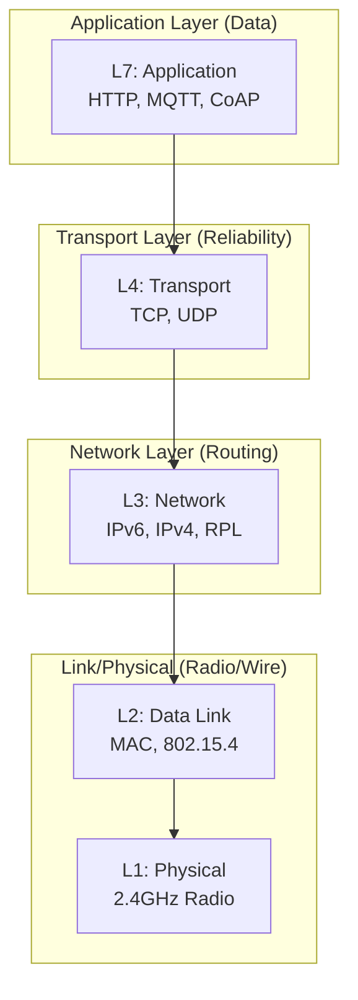
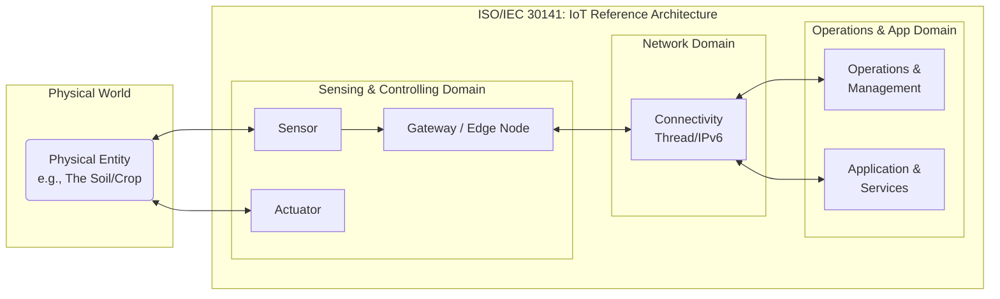
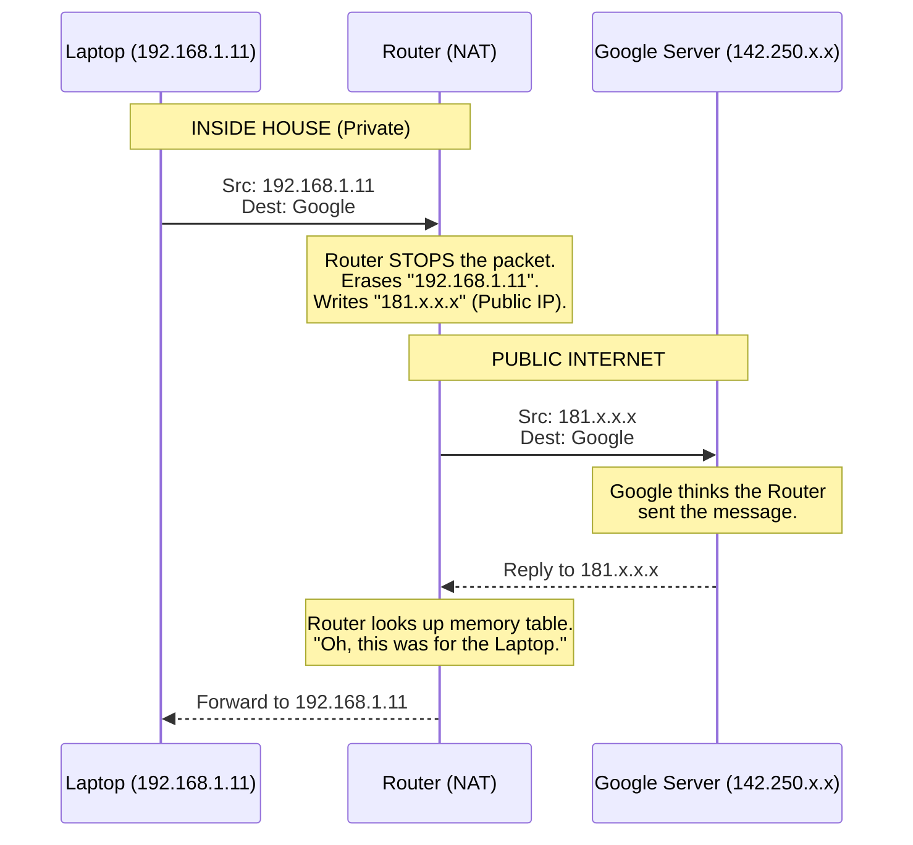
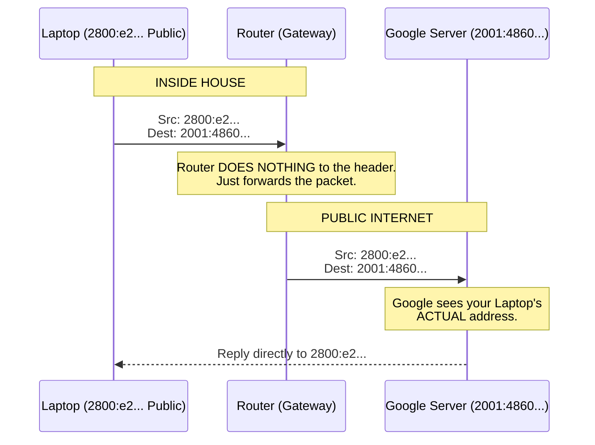
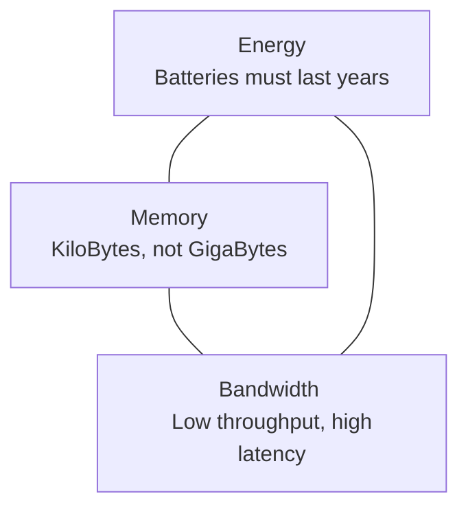

# Networking Fundamentals & IoT Architecture

**GreenField Technologies - Onboarding Module**

**Phase**: Team Alignment

**Topic**: OSI vs. ISO 30141, IPv6, and IoT First Principles

---

## 1. Project Context: Why this module?

**From:** Eng. Samuel Cifuentes (Senior Architect)

**To:** New IoT Systems Engineering Team

**Subject:** Knowledge Alignment

Welcome to the team. Before we start building our precision agriculture mesh network, we need to ensure everyone is aligned on the fundamental technologies we use. We cannot afford architecture errors due to misunderstandings of basic networking principles.

**Objectives**:
1.  **Architecture**: Understand the difference between *Communication Models* (OSI) and *System Models* (ISO/IEC 30141).
2.  **IPv6 Deep Dive**: Our production system uses Thread (IPv6-based). You must understand why we don't use IPv4.
3.  **IoT Constraints**: Understand the "Triangle of Pain" (Energy, Memory, Bandwidth) that drives our decisions.

---

## 2. Architectural Frameworks

To build scalable systems, we must distinguish between *how data moves* and *how the system is organized*.

### 2.1 The Communication Model (OSI)
The **OSI Model** describes the flow of data. In IoT, we often simplify this, but the layers remain critical for debugging.



### 2.2 The IoT Reference Architecture (ISO/IEC 30141)

While OSI explains protocols, **ISO/IEC 30141** explains the **System Domains**. This is how we structure our actual code and hardware.

* **Sensing & Controlling Domain (The Edge):** Where the physical world is digitized (Sensors, Actuators, Gateways).
* **Network Domain:** The infrastructure connecting the edge to the digital services.
* **Operations & Application Domain:** Where the business logic, monitoring, and digital twins reside.



---

## 3. Networking Recap - The Foundation

### What is the Internet?

At its core, the Internet is a global system of interconnected computer networks that use the standard Internet Protocol Suite (TCP/IP). It is a **network of networks**. See [What is internet?](https://www.geeksforgeeks.org/computer-science-fundamentals/what-is-internet-definition-uses-working-advantages-and-disadvantages/) and [¿Qué es Internet?](https://youtu.be/GkA5WOeLWbM)

* **Packet Switching**: Data is broken into small chunks (packets), sent independently, and reassembled at the destination.

### The TCP/IP Model (Simplified for IoT)

For our IoT work, we care about these interactions:

1. **Application**: CoAP / MQTT. *This maps to the Operations Domain in ISO 30141.*
2. **Transport**: UDP (Fast, fire-and-forget). *Preferred for battery-powered nodes.*
3. **Network**: IPv6 (Addressing and Routing). *Getting packets from A to B.*
4. **Link/Physical**: 802.15.4. *Low power radio.*

---

## 4. IPv4 vs IPv6 - The Critical Shift

Traditionally, the internet ran on **IPv4**.

### IPv4 Examples & Analysis

When you run `ip a` on your laptop, you might see: `inet 192.168.1.11/24`.

* **The Problem:** This is a **Private IP**. It only exists inside your house.
* **The Workaround (NAT):** If you want to send data to Google, your router has to "fake" the packet. It erases your IP and writes its own Public IP.
* **The Consequence:** A server in Japan cannot initiate a connection to your device because your device has no public identity.

**Visualizing the IPv4 Packet Flow (The "Post Office" method):**



### Other IPv4 Examples

* **Class A private range**: 10.0.0.1 to 10.255.255.255
* **Class B private range**: 172.16.0.1 to 172.31.255.255
* **Class C private range**: 192.168.0.1 to 192.168.255.255
* **Real-world examples**:
  - 104.244.42.129 (Twitter.com)
  - 151.101.65.140 (Reddit.com)
  - 108.174.10.10 (LinkedIn.com)


### IPv6 Examples & Analysis

**IPv6** uses 128-bit addresses, giving us  addresses.
When you run `ip a`, you will see multiple addresses. Here is how to read them:

1. **Global Unicast (The Goal)**: `2800:e2:807f:f60d...`

* **Meaning:** This is a **Public** address (LACNIC/LatAm region).
* **Capability:** You can talk directly to Japan. No NAT required.

2. **Link-Local (The Internal)**: `fe80::ec9b...`

* **Meaning:** This is for "in-room" talk only. It effectively replaces the Ethernet cable.

**Visualizing the IPv6 Packet Flow (End-to-End):**



**Key Advantages for GreenField:**

1. **No NAT Needed**: Every sensor node has a globally unique public IP.
2. **Auto-configuration (SLAAC)**: Devices generate their own addresses when they join the network.
3. **Efficiency**: Simplified header format for faster processing.

| Feature | IPv4 | IPv6 |
| --- | --- | --- |
| Address Length | 32-bit | 128-bit |
| Example | `192.168.1.50` | `2800:e2:807f::1` |
| Config | DHCP (Manual/Server) | SLAAC (Automatic) |
| Broadcast | Yes (Noisy) | No (Uses Multicast - Efficient) |

---

## 5. Class Exercise: The Human Local Network

**Objective:** Create a real LAN, identify the Gateway, and transfer data between devices without using the Cloud.

**Why:** University networks often use "Client Isolation" which blocks peer-to-peer IoT traffic. To bypass this, we use a **Phone Hotspot** as our Router.

### Phase 1: The Setup (Infrastructure)

1. **Router:** Connect to the Instructor's Samsung Phone Hotspot.
2. **Verify:** This phone is now your **Default Gateway** and **DHCP Server**.

### Phase 2: Discovery (Layer 3)

Find your place on the network map.

```bash
# 1. Find your IP address
ip a # or ipconfig on Windows
# Look for an address like 192.168.x.x or 10.x.x.x

# 2. Find your Gateway (The Router's IP)
ip route # or route show on Windows
# Look for the IP after "default via" (e.g., 10.121.201.198)

```

### Phase 3: Connectivity Test (Ping)

Verify you can reach the infrastructure.

```bash
# Replace with the Gateway IP you found in step 2
ping 10.121.201.198

```

*Note the time (latency). High latency (>100ms) indicates network congestion or power-saving modes.*

### Phase 4: The "IoT" Service (Layer 7)

We will simulate an IoT Sensor serving data.

1. **Server Node (You):**
```bash
echo "<h1>Hello from IoT Node</h1>" > index.html
python3 -m http.server 8000

```


2. **Client Node (Partner):** Open browser to `http://[Your_IP]:8000`

---

## 6. The "Constraint" Triangle

In this course, you will realize that IoT engineering is the art of compromise. Unlike the IT world (Servers), the OT world (IoT) is defined by limits.



1. **Energy**: We sleep 99% of the time.
2. **Memory**: Code must be optimized for size.
3. **Bandwidth**: We send bytes, not 4K video.

---

## 7. The Official Definition (ISO/IEC 30141)

Now that we understand the networking and the constraints, let's define what we are actually building. The **ISO/IEC 30141:2024** standard provides a clear framework for our work.

### Core Definition

> "Fundamental to IoT are devices that interact with the physical world. Sensors collect the information about the physical world, while actuators can act upon the physical world."

These field devices are **connected to the digital world through network connections**, creating a bridge between physical reality and digital systems. See [¿Qué es IoT?](https://youtu.be/u5iho36snrc)

### Why this matters

The standard highlights that IoT is an essential enabler for advanced computing areas that we will touch upon in this course, including **digital twins**, **artificial intelligence**, and **big data**.

---

## 8. Review & References

**Key Reference Text:**

* Herrero, Rolando. *Practical Internet of Things Networking: Understanding IoT Layered Architecture*. Springer, 2023.

**Self-Check Questions:**

1. Why is the ISO 30141 "Sensing Domain" physically separate from the "Application Domain"?
2. Why can't we just give every sensor a static IPv4 address?
3. What is the difference between a "Link-Local" IPv6 address and a "Global" address?
4. Why does the ESP32-C6 need to "sleep" instead of staying connected to WiFi all the time?

---

### Navigation
[< Back to Setup](0_setup.md) | [Next: Project Scenario >](1_project_scenario.md)
