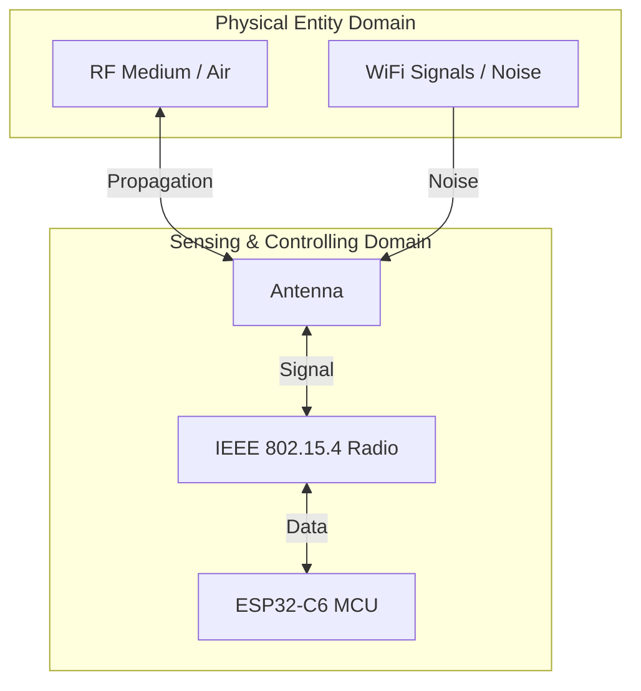

# Lab 1: RF Characterization & Physical Layer
> **Technical Guide:** [SOP-01: Advanced MAC Layer Tuning](sops/sop01_advanced_mac.md)

**GreenField Technologies - SoilSense Project**
**Phase**: Feasibility Study
**Duration**: 2-3 hours

---

## Project Context

### Your Mission This Week

**From:** Eng. Samuel Cifuentes (Senior Architect)
**To:** IoT Systems Engineering Team
**Subject:** ESP32-C6 Radio Validation

Team,

The hardware group selected the ESP32-C6 for our SoilSense sensor nodes based on cost and Thread support. Before we commit to this platform for production, **we need empirical validation** that the 802.15.4 radio meets our requirements for agricultural deployments.

**Your task**: Characterize the RF performance in realistic field conditions. I need data, not vendor specifications.

**Key questions I need answered**:
1. What is the maximum reliable range between sensor nodes?
2. Which channel gives us the cleanest spectrum in the 2.4GHz band?
3. What RSSI threshold predicts 99% packet delivery? (We can't afford 1% data loss)

Document your findings in a DDR with proper ISO/IEC 30141 domain mapping. This is **PED (Physical Entity Domain)** and **SCD (Sensing and Controlling Domain)** work - you're validating the physical layer that everything else depends on.

— Samuel

---

### Stakeholders Counting On You

| Stakeholder | Their Question | How This Lab Helps |
|-------------|----------------|-------------------|
| **Samuel (Architect)** | "Can we trust the ESP32-C6 for our mesh network?" | You'll provide measured link budget and PER data |
| **Gustavo (Product)** | "Will 50m node spacing work for a 10-hectare field?" | You'll determine max range at 99% reliability |
| **Edwin (Operations)** | "What if there's WiFi interference from the farmhouse?" | You'll identify the cleanest channel via spectrum scan |

---

## ISO/IEC 30141:2024 Context

### Domains Addressed in This Lab

**Primary Domain**: **PED (Physical Entity Domain)**
- The "air" between sensor nodes is part of PED
- RF propagation, interference, path loss are physical constraints

**Secondary Domain**: **SCD (Sensing and Controlling Domain)**
- The ESP32-C6 radio (IEEE 802.15.4 transceiver)
- Antenna characteristics

### Viewpoints

**Primary Viewpoint**: **Foundational**
- Answering: "What is an IoT device at the physical layer?"
- Understanding: Resource constraints (power, processing, communication range)

**Secondary Viewpoint**: **Construction**
- Hands-on: Building and deploying ESP32-C6 hardware
- Understanding: How physical layer choices affect higher layers

### Visual Domain Mapping



---

## Learning Objectives

By the end of this lab, you will:

1. **Technical Skills**:
   - Configure ESP32-C6 IEEE 802.15.4 radio
   - Measure RSSI (Received Signal Strength Indicator)
   - Calculate packet error rate (PER)
   - Perform spectrum analysis to detect interference

2. **Architectural Thinking** (ISO/IEC 30141):
   - Map components to PED and SCD domains
   - Understand how physical constraints propagate to system design
   - Apply link budget calculations (first principles)

3. **Professional Practice**:
   - Write ADR documenting channel selection
   - Produce performance baseline report for stakeholders
   - Communicate findings to technical and non-technical audiences

---

## First Principles: Why 802.15.4?

*Read this 5-minute primer before starting lab work. Samuel expects you to understand the "why," not just follow instructions.*

### The Fundamental Constraint: Battery Life

GreenField's product requirement: **3-month battery life on 2× AA batteries (3000 mAh)**.

**Energy budget calculation**:
- Total energy: 3000 mAh × 3V = 9000 mWh = 32,400 joules
- 3 months = 7,776,000 seconds
- Average power budget: 32,400 J / 7,776,000 s = **4.2 mW** (1.4 mA @ 3V)

**Problem**: WiFi transmission costs ~200 mA. Even at 1% duty cycle, that's 2 mA average - we're over budget!

### Why IEEE 802.15.4 Wins

| Protocol | TX Power | RX Power | Range | Why Not? |
|----------|----------|----------|-------|----------|
| **WiFi (802.11n)** | 200 mA | 50 mA | 100m | Power budget exceeded |
| **Bluetooth Classic** | 50 mA | 30 mA | 10m | Too short range |
| **BLE** | 10 mA | 10 mA | 50m | Not designed for mesh |
| **802.15.4** ✅ | 20 mA | 20 mA | 100m+ | Low power + mesh support |

### Why O-QPSK Modulation?

**Question**: Why does 802.15.4 use O-QPSK (Offset Quadrature Phase-Shift Keying) instead of simpler modulations?

**Answer**: Power amplifier efficiency.

- **Simple modulation** (like QAM) varies amplitude → requires **linear amplifier** → 30-40% efficient
- **O-QPSK** has **constant envelope** (amplitude never changes, only phase) → can use **non-linear amplifier** → 70-80% efficient

**Impact on battery**: 2× amplifier efficiency = 2× battery life.

**What you'll observe in this lab**: O-QPSK spreading codes (DSSS - Direct Sequence Spread Spectrum) provide 10 dB processing gain, making the signal robust to interference.

---

## Part 1: Hardware Setup

### Bill of Materials (Per Team)
- 2× ESP32-C6-DevKitC-1
- 2× USB-C cables
- 1× Measuring tape (50m)
- Optional: RF attenuator (for controlled testing)

### Software Environment
- ESP-IDF v5.1+ (installed in Week 0)
- OpenThread SDK

### Initial Configuration

**Task 1.1**: Flash the `ot_cli` example to both ESP32-C6 boards.

```bash
cd $IDF_PATH/examples/openthread/ot_cli
idf.py set-target esp32c6
idf.py build
idf.py -p /dev/ttyUSB0 flash monitor
```

**Verify**: You should see the OpenThread CLI prompt (`>`) on the serial monitor.

**Task 1.2**: Document your hardware setup.

**For your DDR** (Section 4 - Architectural Mapping):
| Component | ISO Domain | Justification |
|-----------|------------|---------------|
| ESP32-C6 SoC | SCD | Sensing/Controlling device (Section 8.3 of standard) |
| 802.15.4 Radio | SCD | Communication subsystem |
| Antenna | SCD | Physical interface to PED |
| Air (RF medium) | PED | Physical entity - electromagnetic propagation |

---

## Part 2: Spectrum Analysis (Answer Edwin's Question)

**Context**: Edwin needs to know if WiFi from the farmhouse will interfere with sensors.

**Task 2.1**: Perform energy detection scan on channels 11-26.

On one ESP32-C6, enter these commands:

```bash
> scan energy 500 0xffff
```

This scans all channels (0xffff = channels 11-26 in bitmap) for 500ms each.

**Expected output**:
```
| Ch | RSSI |
+----+------+
| 11 | -78  |
| 12 | -82  |
| 13 | -85  |
| 14 | -87  |
| 15 | -89  | ← Quietest channel
| 16 | -84  |
...
```

**Task 2.2**: Identify interference sources.

**802.15.4 channel mapping to WiFi**:
- WiFi Channel 1 → 802.15.4 Channels 11-14
- WiFi Channel 6 → 802.15.4 Channels 15-20
- WiFi Channel 11 → 802.15.4 Channels 21-26

**For your DDR** (ADR-001: Channel Selection):
- Which channel did you select and why?
- What is the noise floor on your chosen channel?
- Map this decision to the **PED domain** (you're working around physical interference).

**For Edwin** (Stakeholder Communication):
> *Example: "I selected 802.15.4 Channel 15 because it shows the lowest interference (-89 dBm noise floor). This avoids WiFi Channel 1 and 11 commonly used by farmhouse routers. If you see packet loss in the field, first check for new WiFi networks on Channel 6."*

---

## Part 3: Link Budget & Range Testing (Answer Samuel's Question)

**Context**: Samuel needs empirical data on maximum range for mesh planning.

### Background: The Link Budget Equation

**Friis Transmission Equation**:
```
RSSI (dBm) = Ptx + Gtx + Grx - PL
```

Where:
- Ptx = Transmit power (+8 dBm for ESP32-C6 at max)
- Gtx = TX antenna gain (~2 dBi for PCB antenna)
- Grx = RX antenna gain (~2 dBi)
- PL = Path loss (depends on distance)

**Free-space path loss**:
```
PL (dB) = 20 log₁₀(d) + 20 log₁₀(f) + 32.45
```
For 2.45 GHz at 10m: PL ≈ 60 dB

**Your goal**: Find the distance where RSSI drops below the threshold for 99% packet delivery.

---

### Task 3.1: Point-to-Point Link Establishment

**On Device A** (Router):
```bash
> dataset init new
> dataset channel 15         # Use your selected channel
> dataset commit active
> ifconfig up
> thread start
> state
```

Wait until you see `leader` or `router`.

**On Device B** (End Device):
```bash
> dataset channel 15
> dataset panid 0xabcd        # Match Device A
> dataset commit active
> ifconfig up
> thread start
> state
```

Should show `child` (connected to Device A).

**Task 3.2**: Verify connectivity with ping.

On Device B, get Device A's IPv6 address:
```bash
> ipaddr
fd00:db8::1a2b:3c4d:5e6f (example)
```

On Device A:
```bash
> ping fd00:db8::1a2b:3c4d:5e6f
8 bytes from fd00:db8::1a2b:3c4d:5e6f: icmp_seq=1 time=15ms rssi=-45
```

**Key metric**: Note the RSSI value.

---

### Task 3.3: Range vs RSSI Test

**Procedure**:
1. Start with devices 1m apart
2. Record RSSI from ping output
3. Move Device B to 5m, 10m, 20m, 30m, 40m, 50m
4. At each distance, send 100 pings and calculate **Packet Error Rate (PER)**

**For your DDR** (Performance Baseline):

| Distance (m) | RSSI (dBm) | Packets Sent | Packets Lost | PER (%) |
|--------------|------------|--------------|--------------|---------|
| 1 | -45 | 100 | 0 | 0% |
| 5 | -55 | 100 | 0 | 0% |
| 10 | -65 | 100 | 1 | 1% |
| 20 | -72 | 100 | 3 | 3% |
| 30 | -78 | 100 | 10 | 10% |

**Analysis**:
- **Reliability threshold**: RSSI where PER < 1% (e.g., -70 dBm)
- **Maximum range**: Distance at reliability threshold (e.g., 15-20m in this example)

**For Samuel** (Technical):
> *Example: "I measured a reliability threshold of -70 dBm (1% PER). Using the Friis equation with 10 dB fade margin for vegetation, I recommend 15m maximum spacing for 99% reliability."*

**For Gustavo** (Business):
> *Example: "For a 10-hectare field (100m × 100m), we'll need approximately 49 nodes in a 7×7 grid at 15m spacing. At $40/node, that's $1,960 for sensor hardware."*

---

## Part 4: First Principles Analysis (For Samuel)

**Task 4.1**: Answer these questions in your DDR (Section 5 - First Principles Reflections).

### Question 1: Why does RSSI decrease with distance?

**Expected analysis**:
- Electromagnetic waves spread spherically (inverse square law)
- Power density decreases as 1/r²
- Path loss increases 20 dB per decade of distance

### Question 2: Why do we need >10 dB margin above receiver sensitivity?

**Expected analysis**:
- Receiver sensitivity: ~-100 dBm (minimum detectable signal)
- But we need RSSI > -70 dBm for <1% PER. Why the 30 dB gap?
- **Fading**: Obstacles, reflections, interference cause signal variations
- **Noise floor**: Background RF noise limits SNR
- **Margin**: 10 dB fade margin + 10 dB SNR requirement + 10 dB implementation loss = 30 dB

### Question 3: How does O-QPSK spreading provide interference resilience?

**Expected analysis**:
- DSSS spreads signal across 2 MHz (vs 250 kbps data rate)
- Processing gain: 10 × log₁₀(2000 kHz / 250 kHz) ≈ 9 dB
- Narrow-band interference (like WiFi) affects only part of spread spectrum
- Correlation at receiver recovers signal even with partial spectrum jamming

---

## Deliverables

### 1. DDR Update (Due: End of Week 1)

Update your [DDR Template](../3_deliverables_template.md):

**Section 1**: Fill in Foundational Viewpoint
- What is your IoT device? (ESP32-C6 with 802.15.4 radio)
- Key characteristics: Constrained power, wireless communication, ~15m range

**Section 2**: Stakeholder Communication
- Complete sections for Samuel and Edwin (see examples above)

**Section 3**: ADR-001 - Channel Selection
- Document which channel you chose and why
- Reference PED domain (interference from physical environment)

**Section 4**: Domain Mapping
- Map ESP32-C6 components to SCD
- Map air/RF propagation to PED

**Section 5**: First Principles (answer 3 questions above)

**Section 10**: Performance Baselines (create table from Task 3.3)

**SOP Integration (Mandatory)**:
- Include findings from [SOP-01](sops/sop01_advanced_mac.md) (Experiments A, B, C) in your DDR.
- Document the "Paranoid Radio" and "Ghost Packet" results in the **Experimental Log** section.

---

### 2. Performance Report

Create a 1-page summary for Gustavo (Product Owner):

**GreenField SoilSense - Lab 1 Performance Report**

**Objective**: Validate ESP32-C6 radio for agricultural sensor network

**Key Findings**:
- ✅ Maximum range: ___m at 99% reliability (RSSI > ___ dBm)
- ✅ Recommended node spacing: ___m (includes 10 dB fade margin)
- ✅ Selected channel: 802.15.4 Channel ___ (cleanest spectrum)
- ⚠️ Risk: WiFi interference detected on channels ___ (avoid these)

**Impact on Product**:
- For 10-hectare deployment: ___ nodes required
- Estimated hardware cost: ___ nodes × $40 = $___

**Recommendation**: [Proceed / Need more testing / Switch platforms]

---

### 3. Quick Reference for Edwin

Create a troubleshooting guide:

**SoilSense Field Deployment - RF Checklist**

**Symptom: Device won't join network**
1. Check channel matches network (use `dataset channel` command)
2. Verify antenna connected (loose connector common issue)
3. Check for metal obstructions (barns, silos block RF)

**Symptom: Intermittent packet loss**
1. Check RSSI (should be > -70 dBm for reliability)
2. Scan for WiFi interference (`scan energy 500 0xffff`)
3. Reduce node spacing if vegetation is dense

**Maximum Range Guidelines**:
- Line of sight: ___m
- Through light vegetation: ___m
- Through dense crops: ___m (reduce spacing)

---

## Grading Rubric (Total: 100 points)

### Technical Execution (40 points)
- [ ] Spectrum scan completed, cleanest channel identified (10 pts)
- [ ] Range testing data collected with RSSI and PER (15 pts)
- [ ] Link budget calculation shown (10 pts)
- [ ] Performance baseline table complete (5 pts)

### ISO/IEC 30141 Alignment (30 points)
- [ ] Correct domain mapping (PED, SCD) with justification (10 pts)
- [ ] Foundational viewpoint analysis (10 pts)
- [ ] ADR-001 properly formatted with ISO domain reference (10 pts)

### First Principles Understanding (20 points)
- [ ] Question 1 answered with correct physics (path loss) (7 pts)
- [ ] Question 2 answered with SNR and fading analysis (7 pts)
- [ ] Question 3 answered with DSSS spreading gain (6 pts)

### Professional Communication (10 points)
- [ ] Stakeholder summaries written for Samuel and Edwin (5 pts)
- [ ] Performance report clear and actionable for Gustavo (3 pts)
- [ ] Troubleshooting guide practical for field use (2 pts)

### Ethics Checkpoint (Mandatory Pass/Fail)
- [ ] **Interference Check**: Did you verify your scans didn't disrupt legitimate WiFi users? (Spectrum scanning is passive, but active jamming is unethical).
- [ ] **Resource Usage**: Did you turn off your radios when not testing to save shared spectrum?

---

## Extension Activities (Optional)

### Advanced Task 1: Outdoor Range Test
- Take devices outside to measure actual range in field conditions
- Compare measured path loss to Friis equation prediction
- Document difference (real-world is worse due to multipath, vegetation)

### Advanced Task 2: Interference Mitigation
- Intentionally create interference (turn on WiFi hotspot nearby)
- Measure impact on PER
- Test channel hopping as mitigation

### Advanced Task 3: Power vs Range Tradeoff
- Test different TX power levels (+8 dBm, 0 dBm, -12 dBm)
- Measure impact on range and current consumption
- Calculate battery life at different power levels
- Create ADR for TX power selection

---

## Resources

### ESP-IDF Documentation
- [IEEE 802.15.4 Radio Driver](https://docs.espressif.com/projects/esp-idf/en/latest/esp32c6/api-reference/network/esp_ieee802154.html)
- [OpenThread CLI Reference](https://openthread.io/reference/cli/commands)

### Standards & Theory
- IEEE 802.15.4-2020 Standard (Physical Layer)
- ISO/IEC 30141:2024 Section 8.3 (SCD Domain)
- [References](../references.md) - Thread CLI cheat sheet

### GreenField Project Context
- [Project Scenario](../1_project_scenario.md) - Stakeholder profiles
- [References](../references.md) - Performance baselines and target metrics

---

## What's Next: Lab 2 Preview

**Next week**: 6LoWPAN and IPv6 addressing (SCD domain, Functional viewpoint)

**Samuel's next question**: "How do we fit IPv6 into 127-byte 802.15.4 frames?"

**Preparation**: Read RFC 6282 (6LoWPAN header compression) - understand why we need it.

---

**End of Lab 1 Guide**
