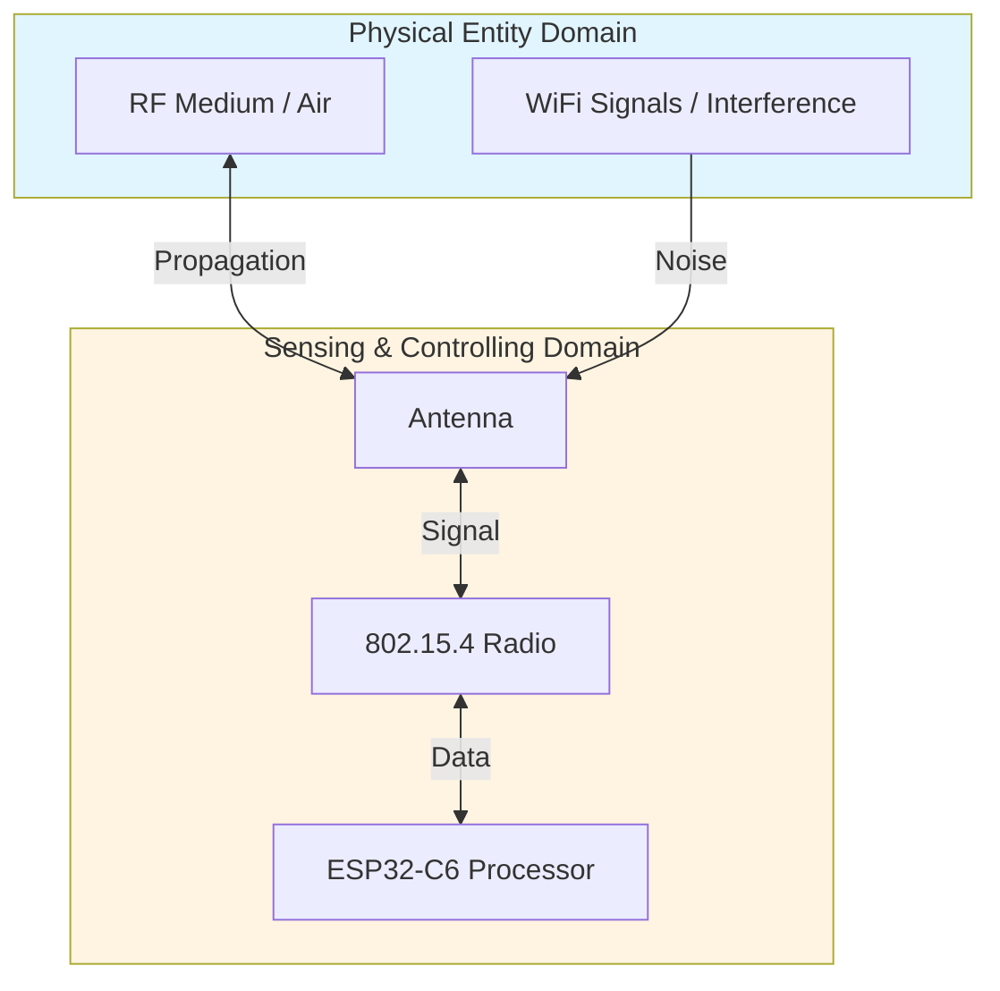

# Lab 1: Testing Your Wireless Radio

**GreenField Technologies - SoilSense Project**
**Phase**: Feasibility Study
**Duration**: 2-3 hours

---

## 📌 What You'll Do Today (TL;DR)

**In plain English**: Test how far your ESP32-C6 devices can talk to each other using their built-in radio.

**Your tasks**:
1. **Find the quietest radio channel** (like finding a quiet FM radio station)
2. **Measure signal strength** at different distances (1m, 5m, 10m, 20m...)
3. **Determine maximum reliable range** (how far apart can sensors be on a farm?)

**Why this matters**: Before building a sensor network, you need to know if the hardware actually works in real-world conditions. Can two sensors 50 meters apart communicate reliably? That's what you'll find out today.

**What you'll learn**: Basic radio concepts (signal strength, interference, range testing) and how to document your findings professionally.

📖 **New to wireless/radio concepts?** Check the [glossary](../glossary.md) for terms like RSSI, PER, link budget, etc.

> **Advanced Technical Guide:** For deeper exploration after you complete the basics, see [SOP-01: Advanced MAC Layer Tuning](sops/sop01_advanced_mac.md)

---

## Project Context

### Your Mission This Week

**From:** Eng. Samuel Cifuentes (Senior Architect)
**To:** IoT Systems Engineering Team
**Subject:** ESP32-C6 Radio Validation

Team,

The hardware group selected the ESP32-C6 for our SoilSense sensor nodes based on cost and Thread support. Before we commit to this platform for production, **we need empirical validation** that the 802.15.4 radio meets our requirements for agricultural deployments.

**Your task**: Characterize the RF performance in realistic field conditions. I need data, not vendor specifications.

**Key questions I need answered**:
1. What is the maximum reliable range between sensor nodes?
2. Which channel gives us the cleanest spectrum in the 2.4GHz band?
3. What RSSI threshold predicts 99% packet delivery? (We can't afford 1% data loss)

Document your findings in a DDR with proper ISO/IEC 30141 domain mapping. This is **PED (Physical Entity Domain)** and **SCD (Sensing and Controlling Domain)** work - you're validating the physical layer that everything else depends on.

— Samuel

---

### Who's Asking For This Data?

**Samuel (your mentor)** needs proof that the ESP32-C6 radio is good enough for this project.
- **His question**: "Can we trust the ESP32-C6 for our sensor network?"
- **What he wants**: Measured data (not vendor specifications)
- **You'll provide**: Signal strength measurements, packet loss rates, channel selection reasoning

**Translation**: Samuel wants to see that you understand *why* things work, not just that you followed instructions. Show your reasoning!

---

## Learning Objectives

By the end of this lab, you will be able to:

1. **Hands-On Radio Testing**:
   - Turn on the ESP32-C6 radio and make two devices talk to each other
   - Measure how strong the wireless signal is (RSSI) 📶
   - Test how many messages get lost at different distances (packet loss)
   - Find which radio channel has the least interference

2. **Understanding the "Why"**:
   - Explain why signal gets weaker as distance increases (it's physics!)
   - Understand why we use this specific radio technology (IEEE 802.15.4) instead of WiFi
   - Calculate the maximum distance sensors can be placed apart

3. **Professional Documentation**:
   - Write your first Architecture Decision Record (ADR) explaining your channel choice
   - Create a simple performance report for non-technical stakeholders
   - Document your findings in a way that other engineers can use

**Don't worry if you've never worked with wireless before** - we'll guide you through each step!

---

## Background: Why This Radio Technology?

**Simple version**: We're using IEEE 802.15.4 radio (not WiFi) because sensor batteries need to last months, not hours.

**The constraint**: GreenField's sensors must run on 2× AA batteries for **3 months**. WiFi uses too much power and would drain batteries in days.

### Quick Comparison

| Technology | Power Usage | Range | Battery Life* | Why Not Use It? |
|----------|----------|----------|-------|----------|
| **WiFi** | Very High (200 mA) | 100m | ~1 week | Kills batteries too fast |
| **Bluetooth** | Medium (50 mA) | 10m | ~1 month | Too short range |
| **802.15.4** ✅ | Low (20 mA) | 100m+ | **3+ months** | Perfect fit! |

*Assuming periodic sensor readings, not continuous transmission

**Bottom line**: IEEE 802.15.4 is the "Goldilocks" solution - just enough range, just enough power efficiency.

<details>
<summary><b>🔬 Advanced: Energy Budget Math & O-QPSK Modulation (Click to expand)</b></summary>

*For students who want to understand the deeper physics and math - not required for lab completion*

### The Fundamental Constraint: Battery Life

GreenField's product requirement: **3-month battery life on 2× AA batteries (3000 mAh)**.

**Energy budget calculation**:
- Total energy: 3000 mAh × 3V = 9000 mWh = 32,400 joules
- 3 months = 7,776,000 seconds
- Average power budget: 32,400 J / 7,776,000 s = **4.2 mW** (1.4 mA @ 3V)

**Problem**: WiFi transmission costs ~200 mA. Even at 1% duty cycle, that's 2 mA average - we're over budget!

### Why O-QPSK Modulation?

**Question**: Why does 802.15.4 use O-QPSK (Offset Quadrature Phase-Shift Keying) instead of simpler modulations?

**Answer**: Power amplifier efficiency.

- **Simple modulation** (like QAM) varies amplitude → requires **linear amplifier** → 30-40% efficient
- **O-QPSK** has **constant envelope** (amplitude never changes, only phase) → can use **non-linear amplifier** → 70-80% efficient

**Impact on battery**: 2× amplifier efficiency = 2× battery life.

**What you'll observe in this lab**: O-QPSK spreading codes (DSSS - Direct Sequence Spread Spectrum) provide 10 dB processing gain, making the signal robust to interference.

📖 **See [glossary](../glossary.md)** for definitions of O-QPSK, DSSS, and modulation.

</details>

---

## Part 1: Hardware Setup

### Bill of Materials (Per Team)
- 2× ESP32-C6-DevKitC-1
- 2× USB-C cables
- 1× Measuring tape (50m)
- Optional: RF attenuator (for controlled testing)

### Software Environment
- ESP-IDF v5.1+ (installed in Week 0)
- OpenThread SDK

### Initial Configuration

**Task 1.1**: Flash the `ot_cli` example to both ESP32-C6 boards.

```bash
cd $IDF_PATH/examples/openthread/ot_cli
idf.py set-target esp32c6
idf.py build
idf.py -p /dev/ttyUSB0 flash monitor
```

**Verify**: You should see the OpenThread CLI prompt (`>`) on the serial monitor.

**Task 1.2**: Document your hardware setup.

**For your DDR** (Section 4 - Architectural Mapping):
| Component | ISO Domain | Justification |
|-----------|------------|---------------|
| ESP32-C6 SoC | SCD | Sensing/Controlling device (Section 8.3 of standard) |
| 802.15.4 Radio | SCD | Communication subsystem |
| Antenna | SCD | Physical interface to PED |
| Air (RF medium) | PED | Physical entity - electromagnetic propagation |

---

## Part 2: Find the Quietest Radio Channel

**In plain English**: Like scanning for a clear FM radio station, you'll find which wireless channel has the least interference.

**Why this matters**: WiFi routers, microwaves, and Bluetooth all use the same 2.4 GHz frequency band. You need to find a "quiet" channel where your sensors won't get drowned out by interference.

📖 **Terms**: See [glossary](../glossary.md) for *spectrum*, *interference*, *channel*, *RSSI*

**Task 2.1**: Scan all available channels to measure background noise.

On one ESP32-C6, enter these commands:

```bash
> scan energy 500 0xffff
```

This scans all channels (0xffff = channels 11-26 in bitmap) for 500ms each.

**Expected output**:
```
| Ch | RSSI |
+----+------+
| 11 | -78  |  ← More noise (WiFi interference)
| 12 | -82  |
| 13 | -85  |
| 14 | -87  |
| 15 | -89  |  ← Quietest channel! ✅
| 16 | -84  |
...
```

**How to read this**:
- **RSSI** = Received Signal Strength Indicator (measured in dBm)
- **Lower numbers** (more negative) = quieter = better for your sensors
- **-89 dBm** is quieter than **-78 dBm**

**What you're looking for**: The channel with the **lowest** (most negative) RSSI = least interference.

📖 **See [glossary](../glossary.md)** for *RSSI*, *dBm*, *noise floor*

**Task 2.2**: Understand where interference comes from.

**802.15.4 channel mapping to WiFi**:
- WiFi Channel 1 → 802.15.4 Channels 11-14
- WiFi Channel 6 → 802.15.4 Channels 15-20
- WiFi Channel 11 → 802.15.4 Channels 21-26

**For your DDR** (ADR-001: Channel Selection):
- Which channel did you select and why?
- What is the noise floor on your chosen channel?
- Map this decision to the **PED domain** (you're working around physical interference).

**For Edwin** (Stakeholder Communication):
> *Example: "I selected 802.15.4 Channel 15 because it shows the lowest interference (-89 dBm noise floor). This avoids WiFi Channel 1 and 11 commonly used by farmhouse routers. If you see packet loss in the field, first check for new WiFi networks on Channel 6."*

---

## Part 3: Range Testing - How Far Can Devices Talk?

**In plain English**: You'll measure signal strength at different distances to find the maximum reliable range.

**Context**: Samuel needs real-world data on how far apart sensors can be placed.

**Your goal**: Find the distance where too many messages start getting lost (packet loss > 1%).

### Background: What Is "Link Budget"?

**Simple explanation**: Link budget is just accounting for signal strength from transmitter to receiver.

**Think of it like shouting across a field**:
- **Transmit power**: How loud you shout
- **Antenna gain**: Using a megaphone (amplifies your voice)
- **Path loss**: Sound gets quieter as distance increases
- **RSSI** (Received Signal Strength): How loud it sounds when it reaches the other person

**Formula** (don't worry about memorizing this):
```
RSSI = Transmit Power + Antenna Gains - Path Loss
```

**What matters for this lab**: The further apart devices are, the weaker the signal (RSSI) becomes. At some distance, the signal becomes too weak and messages get lost.

<details>
<summary><b>📐 Advanced: Friis Transmission Equation & Math (Click to expand)</b></summary>

**Friis Transmission Equation**:
```
RSSI (dBm) = Ptx + Gtx + Grx - PL
```

Where:
- Ptx = Transmit power (+8 dBm for ESP32-C6 at max)
- Gtx = TX antenna gain (~2 dBi for PCB antenna)
- Grx = RX antenna gain (~2 dBi)
- PL = Path loss (depends on distance)

**Free-space path loss**:
```
PL (dB) = 20 log₁₀(d) + 20 log₁₀(f) + 32.45
```
For 2.45 GHz at 10m: PL ≈ 60 dB

**Interpretation**: Every time you double the distance, you lose 6 dB of signal strength.

</details>

---

### Task 3.1: Make Two Devices Talk to Each Other

**Goal**: Get Device A and Device B connected so you can test signal strength.

**On Device A** (first device):
```bash
> dataset init new
> dataset channel 15         # Use your selected channel from Part 2
> dataset commit active
> ifconfig up
> thread start
> state
```

Wait until you see `leader` (Device A is now ready and waiting for Device B).

**On Device B** (second device):
```bash
> dataset channel 15         # Must match Device A's channel!
> dataset panid 0xabcd        # Network ID (can be any hex value)
> dataset commit active
> ifconfig up
> thread start
> state
```

Should show `child` (Device B has connected to Device A successfully ✅).

**What just happened?** You created a simple two-device network. Device A is the coordinator, Device B joined it. Think of it like Device A creating a WiFi hotspot and Device B connecting to it.

**Task 3.2**: Verify connectivity with ping.

On Device B, get Device A's IPv6 address:
```bash
> ipaddr
fd00:db8::1a2b:3c4d:5e6f (example)
```

On Device A:
```bash
> ping fd00:db8::1a2b:3c4d:5e6f
8 bytes from fd00:db8::1a2b:3c4d:5e6f: icmp_seq=1 time=15ms rssi=-45
```

**Key metric**: Note the RSSI value.

---

### Task 3.3: Test Signal Strength at Different Distances

**Goal**: Find out how far apart sensors can be while still communicating reliably.

**Procedure**:
1. Start with devices **1 meter apart** (baseline measurement)
2. Use the `ping` command to send messages and **record the RSSI** (signal strength)
3. Move Device B further away: **5m, 10m, 20m, 30m...** (use measuring tape)
4. At each distance, send **100 pings** and count how many fail

**What you're measuring**:
- **RSSI**: Signal strength (higher = better, less negative)
- **PER** (Packet Error Rate): Percentage of messages that get lost

📖 **See [glossary](../glossary.md)** for *RSSI*, *PER*, *packet loss*

**Record your results in a table like this**:

| Distance (m) | RSSI (dBm) | Packets Sent | Packets Lost | PER (%) |
|--------------|------------|--------------|--------------|---------|
| 1 | -45 | 100 | 0 | 0% | ← Very close, perfect signal
| 5 | -55 | 100 | 0 | 0% |
| 10 | -65 | 100 | 1 | 1% | ← Starting to see packet loss
| 20 | -72 | 100 | 3 | 3% |
| 30 | -78 | 100 | 10 | 10% | ← Too far! Unreliable

**How to calculate PER** (Packet Error Rate):
```
PER = (Packets Lost / Packets Sent) × 100%
Example: (10 lost / 100 sent) × 100% = 10%
```

**What you're looking for**:
- **Reliability threshold**: The RSSI value where packet loss stays below 1%
- **Maximum reliable range**: How far apart devices can be before losing >1% of messages

**In this example**:
- Reliable up to ~15m (RSSI stays above -70 dBm)
- At 20m, too many packets are lost (3% failure rate)
- **Recommendation**: Don't place sensors more than 15m apart

**For Samuel** (Technical):
> *Example: "I measured a reliability threshold of -70 dBm (1% PER). Using the Friis equation with 10 dB fade margin for vegetation, I recommend 15m maximum spacing for 99% reliability."*

**For Gustavo** (Business):
> *Example: "For a 10-hectare field (100m × 100m), we'll need approximately 49 nodes in a 7×7 grid at 15m spacing. At $40/node, that's $1,960 for sensor hardware."*

---

## Part 4: Understanding the "Why" (Reflections for Samuel)

Samuel wants you to think deeper than just collecting data. Answer these questions in your DDR to show you understand the underlying principles.

**Task 4.1**: Answer these three questions (don't just copy these answers - explain in your own words!)

### Question 1: Why does signal strength (RSSI) get weaker as distance increases?

**In plain English**: Think about a light bulb. The further you move away, the dimmer it appears. Why?

**The physics**: Radio waves spread out in all directions (like a sphere). As the sphere gets bigger, the same amount of energy is spread over a larger area. This is called the **inverse square law** - double the distance, signal strength drops by 75%.

**Your answer should mention**: Electromagnetic waves spreading, power density decreasing, path loss.

📖 **See [glossary](../glossary.md)** for *path loss*, *inverse square law*, *free-space propagation*

---

### Question 2: Why isn't -100 dBm strong enough for reliable communication?

**The puzzle**: The ESP32-C6 receiver can technically detect signals as weak as -100 dBm. But in your testing, you probably found you need RSSI > -70 dBm for <1% packet loss. Why the 30 dB difference?

**Hint**: Think about obstacles (trees, walls), other wireless devices creating noise, and signal variations.

**Your answer should explain**:
- **Fading**: Signal bounces off objects, creating weaker "copies"
- **Noise floor**: Background interference from WiFi, microwaves, etc.
- **Safety margin**: Need extra signal strength to handle worst-case conditions

**Formula**: Minimum RSSI = Receiver Sensitivity + Fade Margin + SNR Requirement

📖 **See [glossary](../glossary.md)** for *fade margin*, *SNR (Signal-to-Noise Ratio)*, *receiver sensitivity*

---

### Question 3 (Advanced): How does the radio fight interference?

**Context**: WiFi and your sensors share the 2.4 GHz band. How can your sensor still work when a WiFi router is nearby?

**The answer**: 802.15.4 uses a clever trick called **spread spectrum** (DSSS). Instead of sending data on one narrow frequency, it spreads it across a wider range. Think of it like whispering your message across 100 people instead of shouting through 1 person - even if a few people are distracted (interference), the message still gets through.

**Technical detail**: Spreading provides ~9 dB of "processing gain," making the signal more robust.

*(This question is optional for students new to wireless - focus on Questions 1 and 2 first)*

📖 **See [glossary](../glossary.md)** for *spread spectrum*, *DSSS*, *O-QPSK*

---

## Understanding the ISO/IEC 30141 Framework

**Now that you've done the hands-on work**, let's map what you did to the professional architecture framework (ISO/IEC 30141:2024).

**Why this matters**: When you talk to other IoT engineers or write professional documentation, everyone uses this common language. It's like learning the official terms for things you've already experienced.

### Domains You Worked With Today

**In plain English, you tested**:
1. **The air between devices** (radio waves traveling through space)
2. **The ESP32-C6 hardware** (radio chip, antenna, processor)

**In ISO/IEC 30141 language**:

| What You Tested | ISO Domain | Why It's Classified This Way |
|-----------------|------------|------------------------------|
| Radio waves, interference, signal loss | **PED** (Physical Entity Domain) | The electromagnetic field is a physical phenomenon |
| ESP32-C6 radio, antenna | **SCD** (Sensing & Controlling Domain) | The devices that sense or control physical entities |

### Visual Mapping



**For your DDR** (Section 4 - Architectural Mapping):
- List each component (ESP32-C6, antenna, air/RF medium)
- Assign it to the correct domain (PED or SCD)
- Justify why (1-2 sentences)

**Example**:
> "The ESP32-C6's 802.15.4 radio belongs to the **SCD (Sensing & Controlling Domain)** because it's the communication subsystem that enables sensing devices to exchange data (per ISO/IEC 30141 Section 8.3)."

📖 **See** [2_iso_architecture.md](../2_iso_architecture.md) for detailed explanations of all six domains.

---

## Deliverables

### 1. DDR (Design Decision Record) Update

**What is a DDR?** A living document that tracks all your architectural decisions throughout the course. Think of it as your engineering notebook.

**Where to start**: Use the [DDR Template](../3_deliverables_template.md) provided.

**What to update after Lab 1**:

| Section | What to Write | Example |
|---------|---------------|---------|
| **Section 1**: Foundational Viewpoint | Describe your IoT device | "ESP32-C6 with 802.15.4 radio, battery-powered, max range ~15m" |
| **Section 2**: Stakeholder Communication | Summarize findings for Samuel | See examples in Part 3 (Answer Samuel's Question) |
| **Section 3**: ADR-001 | Explain channel selection | "Selected Channel 15 because noise floor was -89 dBm..." |
| **Section 4**: Domain Mapping | List components and their ISO domains | "ESP32-C6 radio → SCD; Air → PED" |
| **Section 5**: First Principles | Answer the 3 questions from Part 4 | Explain inverse square law, fade margin, etc. |
| **Section 10**: Performance Baselines | Paste your range testing table | Distance vs RSSI vs PER data |

**Don't overthink this!** The DDR is iterative - you'll improve it each week. For Lab 1, just get something written down.

**Optional Advanced Exploration**:
- If you completed [SOP-01: Advanced MAC Layer Tuning](sops/sop01_advanced_mac.md), include those findings in an "Advanced Experiments" section of your DDR
- This is optional - focus on the core lab tasks first!

---

### 2. One-Page Performance Summary

**What is this?** A concise report for non-technical stakeholders (like the Product Owner) who don't need all the technical details.

**Format**: Fill in the blanks below with your actual measurements:

---

**GreenField SoilSense - Lab 1 Performance Report**

**Objective**: Test if ESP32-C6 radio works for farm sensor networks

**Key Findings**:
- ✅ Maximum reliable range: **___m** (packet loss < 1% when RSSI > ___ dBm)
- ✅ Recommended sensor spacing: **___m** (includes safety margin for vegetation/obstacles)
- ✅ Best radio channel: **802.15.4 Channel ___** (least interference: ___ dBm noise floor)
- ⚠️ Risk: WiFi interference detected on channels ___ (avoid deploying sensors near these)

**Impact on Product**:
- For a 10-hectare farm field: approximately **___ sensor nodes** required
- Estimated hardware cost: ___ nodes × $40/node = **$___**

**Recommendation**: [Choose one]
- ✅ **Proceed** - ESP32-C6 meets requirements
- ⚠️ **Need more testing** - Explain what concerns remain
- ❌ **Switch platforms** - Explain why ESP32-C6 isn't suitable

---

**Keep it simple!** Use bullet points, not paragraphs. Gustavo wants numbers and clear recommendations.

---

### 3. Quick Reference for Edwin

Create a troubleshooting guide:

**SoilSense Field Deployment - RF Checklist**

**Symptom: Device won't join network**
1. Check channel matches network (use `dataset channel` command)
2. Verify antenna connected (loose connector common issue)
3. Check for metal obstructions (barns, silos block RF)

**Symptom: Intermittent packet loss**
1. Check RSSI (should be > -70 dBm for reliability)
2. Scan for WiFi interference (`scan energy 500 0xffff`)
3. Reduce node spacing if vegetation is dense

**Maximum Range Guidelines**:
- Line of sight: ___m
- Through light vegetation: ___m
- Through dense crops: ___m (reduce spacing)

---

## Grading Rubric (Total: 100 points)

### Technical Execution (40 points)
- [ ] Spectrum scan completed, cleanest channel identified (10 pts)
- [ ] Range testing data collected with RSSI and PER (15 pts)
- [ ] Link budget calculation shown (10 pts)
- [ ] Performance baseline table complete (5 pts)

### ISO/IEC 30141 Alignment (30 points)
- [ ] Correct domain mapping (PED, SCD) with justification (10 pts)
- [ ] Foundational viewpoint analysis (10 pts)
- [ ] ADR-001 properly formatted with ISO domain reference (10 pts)

### First Principles Understanding (20 points)
- [ ] Question 1 answered with correct physics (path loss) (7 pts)
- [ ] Question 2 answered with SNR and fading analysis (7 pts)
- [ ] Question 3 answered with DSSS spreading gain (6 pts)

### Professional Communication (10 points)
- [ ] Stakeholder summaries written for Samuel and Edwin (5 pts)
- [ ] Performance report clear and actionable for Gustavo (3 pts)
- [ ] Troubleshooting guide practical for field use (2 pts)

### Ethics Checkpoint (Mandatory Pass/Fail)
- [ ] **Interference Check**: Did you verify your scans didn't disrupt legitimate WiFi users? (Spectrum scanning is passive, but active jamming is unethical).
- [ ] **Resource Usage**: Did you turn off your radios when not testing to save shared spectrum?

---

## Extension Activities (Optional)

### Advanced Task 1: Outdoor Range Test
- Take devices outside to measure actual range in field conditions
- Compare measured path loss to Friis equation prediction
- Document difference (real-world is worse due to multipath, vegetation)

### Advanced Task 2: Interference Mitigation
- Intentionally create interference (turn on WiFi hotspot nearby)
- Measure impact on PER
- Test channel hopping as mitigation

### Advanced Task 3: Power vs Range Tradeoff
- Test different TX power levels (+8 dBm, 0 dBm, -12 dBm)
- Measure impact on range and current consumption
- Calculate battery life at different power levels
- Create ADR for TX power selection

---

## Resources

### ESP-IDF Documentation
- [IEEE 802.15.4 Radio Driver](https://docs.espressif.com/projects/esp-idf/en/latest/esp32c6/api-reference/network/esp_ieee802154.html)
- [OpenThread CLI Reference](https://openthread.io/reference/cli/commands)

### Standards & Theory
- IEEE 802.15.4-2020 Standard (Physical Layer)
- ISO/IEC 30141:2024 Section 8.3 (SCD Domain)
- [References](../references.md) - Thread CLI cheat sheet

### GreenField Project Context
- [Project Scenario](../1_project_scenario.md) - Stakeholder profiles
- [References](../references.md) - Performance baselines and target metrics

---

## What's Next: Lab 2 Preview

**Next week**: 6LoWPAN and IPv6 addressing (SCD domain, Functional viewpoint)

**Samuel's next question**: "How do we fit IPv6 into 127-byte 802.15.4 frames?"

**Preparation**: Read RFC 6282 (6LoWPAN header compression) - understand why we need it.

---

**End of Lab 1 Guide**
