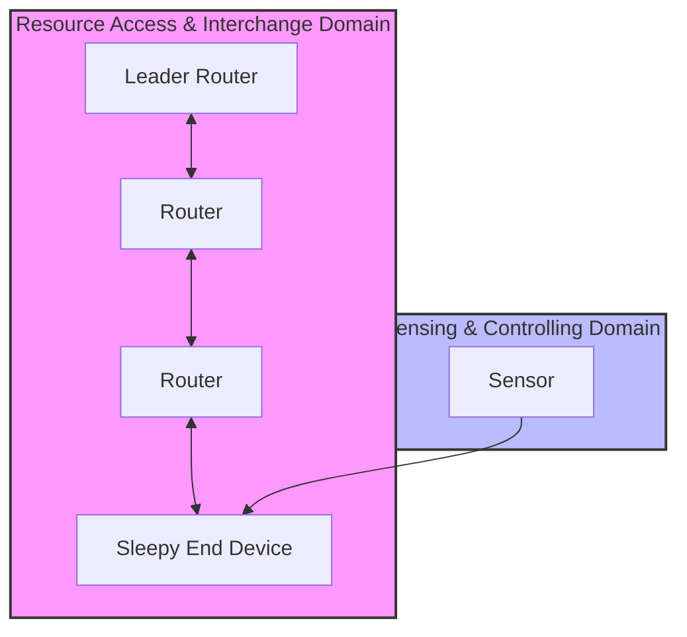

# Lab 2: 6LoWPAN Mesh Networking & Resilience
> **Technical Guide:** [SOP-02: 6LoWPAN + Routing & Resilience](sops/sop02_6lowpan.md)

**GreenField Technologies - SoilSense Project**
**Phase:** Core Connectivity
**Duration:** 3 hours
**ISO Domains:** RAID (Resource Access), SCD (Sensing & Controlling)

---

## 1. Project Context

### Your Mission This Week

**From:** Maria Santos (Field Operations Lead)
**To:** Firmware Team
**Subject:** URGENT: Tractor incident & Network gaps

Team,

The field tests from Lab 1 were promising, but we have a problem. One of the pilot farmers just drove a tractor over a sensor node. In our current point-to-point setup, everything behind that node went dark.

**We cannot rely on a star topology.** We need a self-healing Mesh.

We have selected **OpenThread** (IPv6 over Low-Power Wireless Personal Area Networks). I need you to configure the nodes to route around failures automatically.

**My Requirements:**
1.  **Coverage:** We need to reach the "Far Field" (simulated by 3 hops in the lab).
2.  **Resilience:** If a Router dies, the network must heal in **< 2 minutes**.
3.  **Latency:** Ops needs to know if the multi-hop latency is too high for real-time valve control.

— Maria

### Stakeholders Counting On You

| Stakeholder | Their Question | How This Lab Helps |
|---|---|---|
| **Maria (Ops)** | "If a cow steps on a node, does the network survive?" | You will simulate node failure and measure healing time. |
| **Samuel (Architect)** | "Is the hop-count latency acceptable?" | You will measure RTT over 1 vs 3 hops. |
| **ISO 30141 Auditor** | "How are resources accessed across the domain?" | You are implementing the **RAID** domain (Routing). |

---

## ISO/IEC 30141 Context

### Visual Domain Mapping

---

## 2. Theory Preamble (15 min)
*Reference: [Theory Foundations](../5_theory_foundations.md) > Lab 2: 6LoWPAN*

* **The Concept:** 6LoWPAN (IPv6 over Low-Power WPAN).
* **The Mechanism:** **MLE (Mesh Link Establishment)**. Nodes use "Trickle Timers" to advertise their presence.
* **The Trade-off:** A "Router" is always on (RX enabled), consuming ~30mA. A "Sleepy End Device" sleeps, consuming 5uA.

---

## 3. Execution Tasks

### Task A: The Commissioning
Use the OpenThread CLI to form a secure network.
* **Constraint:** Do not use default PANID.
* **Verify:** Use `neighbor table` to confirm Link Quality (LQI) > 100.

### Task B: The "Far Field" Simulation (Latency)
Force a topology where Node A -> Node B -> Node C (3 hops).
* **Measure:** Ping Round Trip Time (RTT) from A to C.
* **DDR Entry:** Compare this to the Lab 1 (1 hop) latency.

### Task C: The "Tractor Test" (Resilience)
1.  Start a continuous ping from the Edge Node to the Border Router.
2.  **Act:** Unplug the intermediate Router (simulate the tractor crushing it).
3.  **Observe:** The pings will stop.
4.  **Measure:** How many seconds until pings resume? (This is your "Convergence Time").

---

## 4. Deliverables (Update your DDR)

* **ADR-002 (Topology):** Why did we choose Thread (Mesh) over LoRaWAN (Star) for this specific deployment? (Hint: Actuator control requires low latency).
* **Performance Baseline:** Did the network heal in < 120 seconds?
* **ISO Reflection:** Map the "Router" and "Leader" roles to the **Functional Viewpoint**.

---

## Grading Rubric (Total: 100 points)

### Technical Execution (40 points)
- [ ] Mesh formation successful with custom PANID (10 pts)
- [ ] Healing time measured and recorded (15 pts)
- [ ] Latency comparison (1 hop vs 3 hops) completed (15 pts)

### ISO/IEC 30141 Alignment (30 points)
- [ ] Functional Viewpoint analysis (Router/Leader roles) (15 pts)
- [ ] RAID domain mapping explained (15 pts)

### Analysis (20 points)
- [ ] ADR-002 (Topology) justification with latency vs range trade-off (10 pts)
- [ ] First Principles reflection on mesh power consumption (10 pts)

### Ethics Checkpoint (Mandatory Pass/Fail)
- [ ] **Resilience**: Did your healing tests disrupt other groups?
- [ ] **Resource Usage**: Did you disable the router after testing to save power/spectrum?
