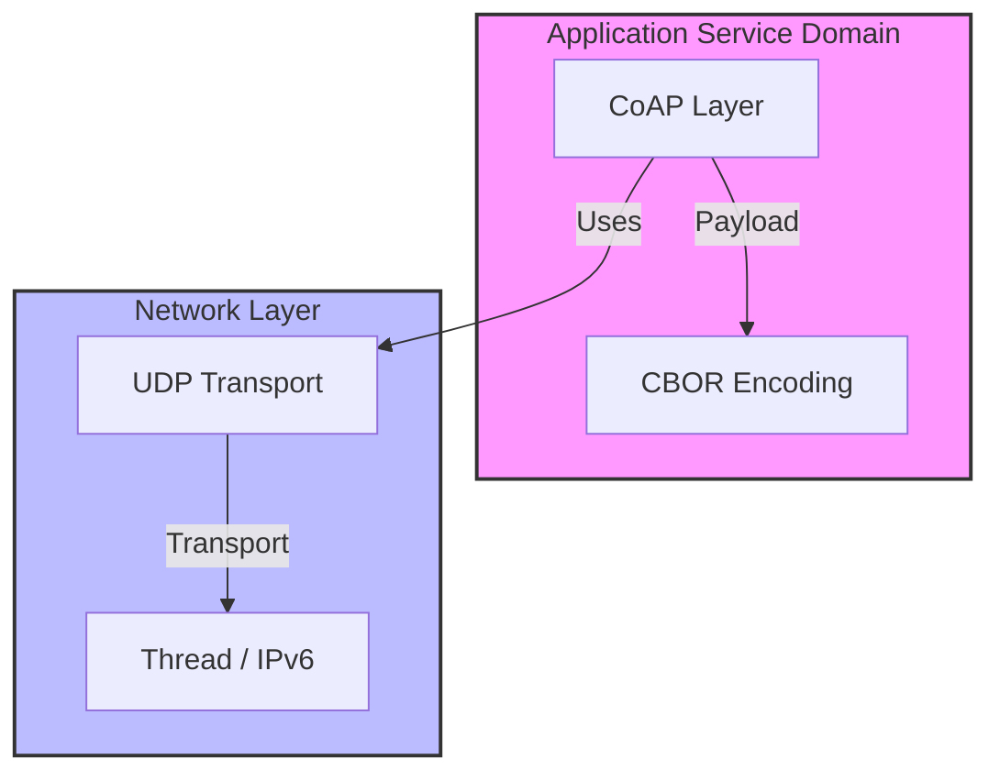

# Lab 3: Efficient Data Transport (CoAP & CBOR)
> **Technical Guide:** [SOP-03: Thread/CoAP Basic](sops/sop03_coap_basic.md)

**GreenField Technologies - SoilSense Project**
**Phase:** Application Optimization
**Duration:** 3 hours
**ISO Domains:** ASD (Application), UD (User)

---

## 1. Project Context

### Your Mission This Week

**From:** Daniela (Pilot Customer) via Product Team
**To:** Firmware Team
**Subject:** Batteries dying too fast & Dashboard lag

Hi Team,

Feedback from Daniela's farm:
1.  **Batteries are dead:** The prototypes from last week died in 4 days.
2.  **Data is slow:** She says the dashboard takes forever to update.

Analysis by Samuel shows we are using **HTTP over JSON**. This is too heavy. The radio is staying on too long to send `{ "temperature": 25.5 }`.

**Your Mission:** Switch the stack to **CoAP (Constrained Application Protocol)** and **CBOR (Binary)**.
* **Goal:** Reduce packet size by 40%.
* **Goal:** Implement "Observe" (Push) so we stop polling the sensors.

— Product Team

### Stakeholders Counting On You

| Stakeholder | Their Question | How This Lab Helps |
|---|---|---|
| **Daniela (Farmer)** | "Why do I have to change batteries every week?" | CoAP/UDP removes TCP overhead, saving energy. |
| **Cloud Team** | "Why is the data ingress bandwidth so high?" | CBOR compresses the payload, reducing cloud costs. |
| **ISO 30141 Auditor** | "Is the data interface standard?" | You are defining the **ASD** service contract. |

---

## ISO/IEC 30141 Context

### Visual Domain Mapping

---

## 2. Theory Preamble (15 min)
*Reference: [Theory Foundations](../5_theory_foundations.md) > Lab 3: CoAP & CBOR*

* **CoAP vs HTTP:** CoAP runs over UDP. No 3-way handshake.
* **CBOR vs JSON:**
    * JSON: `{"t": 24.5}` (10 bytes).
    * CBOR: `A1 61 74 F9 45 00` (6 bytes).
    * **Result:** Shorter "Radio On" time.

---

## 3. Execution Tasks

### Task A: The API Definition
Create a CoAP resource at `/env/temp`.
* **Method:** `GET`
* **Format:** CBOR containing a float.

### Task B: The "Observe" Pattern
Instead of the client asking "What is the temp?" every minute (Polling), the Server should **Push** data *only* when it changes.
* **Implementation:** Trigger a notification only if `abs(new_temp - old_temp) > 0.5`.

### Task C: Efficiency Audit
Use Wireshark (or log packet size).
* **Calculate:** (Header + Payload) size.
* **Compare:** Estimate the size of the equivalent HTTP packet.

---

## 4. Deliverables (Update your DDR)

* **ADR-003 (Protocol):** Rationale for CoAP/UDP. Explicitly mention the **Packet Overhead** baseline.
* **Energy Calculation:** If CoAP saves 50ms of radio time per transmission, how much battery life does that add over 1 year? (See [References](../references.md) for performance baselines).

---

## Grading Rubric (Total: 100 points)

### Technical Execution (40 points)
- [ ] CoAP resource `/env/temp` working with CBOR (15 pts)
- [ ] Observe mechanism functional (push on change) (15 pts)
- [ ] Packet size comparison (CoAP vs HTTP) (10 pts)

### ISO/IEC 30141 Alignment (30 points)
- [ ] ASD domain definition (Service Contract) (15 pts)
- [ ] Protocol stack mapping correctly identified (15 pts)

### Analysis (20 points)
- [ ] ADR-003 (Protocol) justification (10 pts)
- [ ] Energy saving calculation (10 pts)

### Ethics Checkpoint (Mandatory Pass/Fail)
- [ ] **Sustainability**: Did you verify that "Observe" actually reduces traffic compared to Polling?
- [ ] **Transparency**: Is the data format (CBOR) documented so others can decode it?
