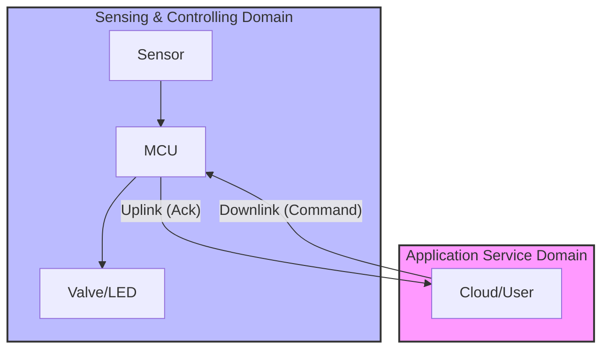

# Lab 4: Reliability & Downlink Control
> **Technical Guide:** [SOP-04: Sensor Integration and Dashboards](sops/sop04_sensor_integration.md)

**GreenField Technologies - SoilSense Project**
**Phase:** Control Logic
**Duration:** 3 hours
**ISO Domains:** SCD (Sensing/Controlling), ASD (Application)

---

## 1. Project Context

### Your Mission This Week

**From:** Edwin (Field Operations Lead)
**To:** Firmware Team
**Subject:** The irrigation valve didn't open!

We have a major issue. Last week's code works great for *reading* sensors (Uplink), but fails for *controlling* the water valves (Downlink).

I tried to send an "OPEN" command from the HQ console to the valve node.
1.  The command failed because the node was sleeping.
2.  When the node finally woke up, it didn't know I had sent a command.
3.  **Result:** The seedlings dried out.

**Mission:** Implement a reliable Downlink mechanism.
* The valve must eventually get the message, even if it sleeps.
* We need acknowledgment (ACK) that the valve actually opened.

— Edwin

### Stakeholders Counting On You

| Stakeholder | Their Question | How This Lab Helps |
|---|---|---|
| **Edwin (Ops)** | "How do I control a sleeping device?" | Implementing CoAP polling and "Mailbox" patterns. |
| **Samuel (Architect)** | "What if the message gets lost?" | Using CoAP **CON** (Confirmable) messaging. |
| **ISO 30141 Auditor** | "Is the Actuation reliable?" | You are validating the **SCD** (Control) loop. |

---

## ISO/IEC 30141 Context

### Visual Domain Mapping

---

## 2. Theory Preamble (15 min)
*Reference: [Theory Foundations](../5_theory_foundations.md) > Lab 4: Reliability & Downlink*

* **Uplink vs Downlink:** Sending data *to* the cloud is easy (Node initiates). Receiving data *from* the cloud is hard (Node is asleep).
* **Poll Period:** The "Sleepy End Device" must wake up periodically (e.g., every 5s) to ask its parent: "Do you have messages for me?"
* **Idempotency:** If I send "OPEN VALVE" twice by mistake, it shouldn't open, close, and open again. It should just stay open.

---

## 3. Execution Tasks

### Task A: The Actuator Resource
Create a CoAP resource `/farm/valve`.
* **PUT:** Accepts "1" (Open) or "0" (Close).
* **GET:** Returns current state.
* **Hardware:** Connect an LED to GPIO to simulate the Valve.

### Task B: Reliable Messaging (CON)
Modify your client to send **CON (Confirmable)** requests.
* **Experiment:** Unplug the Valve node. Send the command.
* **Observe:** The client should retry (Exponential Backoff) and eventually timeout.
* **Reconnect:** Plug the node back in. Send command. Verify the Client receives an ACK.

### Task C: Tuning the "Poll Period"
* **Scenario:** Set `POLL_PERIOD` to 10 seconds.
* **Test:** Send a command. Measure the lag.
* **Trade-off:** Fast response = High battery usage. Slow response = Frustrated Edwin.
* **Goal:** Find the "Sweet Spot" (ADR required).

---

## 4. Deliverables (Update your DDR)

* **ADR-004 (Latency):** What Poll Period did you choose? Why? (Map to **User Domain** requirements).
* **Reliability Check:** Screenshot of the CoAP ACK packet in Wireshark.

---

## Grading Rubric (Total: 100 points)

### Technical Execution (40 points)
- [ ] Actuator resource `/farm/valve` responds to PUT/GET (10 pts)
- [ ] CON messaging verified with node disconnection test (15 pts)
- [ ] Poll period tuning experiment completed (15 pts)

### ISO/IEC 30141 Alignment (30 points)
- [ ] SCD domain (Actuation) validation (15 pts)
- [ ] Reliability/Feedback loop concept explained (15 pts)

### Analysis (20 points)
- [ ] ADR-004 (Latency/Poll Period) justification (10 pts)
- [ ] Idempotency concept explained in context (10 pts)

### Ethics Checkpoint (Mandatory Pass/Fail)
- [ ] **Safety**: What happens if the valve receives "OPEN" but the network dies before "CLOSE"? (Failsafe design).
- [ ] **Privacy**: Did you minimize data collection in the Uplink while testing Downlink?
