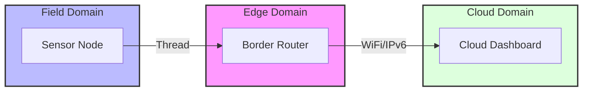

# Lab 5: The Border Router (Cloud Connectivity)
> **Technical Guide:** [SOP-05: Border Router Deployment](sops/sop05_border_router.md)

**GreenField Technologies - SoilSense Project**
**Phase:** Integration
**Duration:** 3 hours
**ISO Domains:** RAID (Resource Access), Construction View

---

## 1. Project Context

### Your Mission This Week

**From:** Samuel Cifuentes (Senior Architect)
**To:** Firmware Team
**Subject:** Breaking out of the local mesh

Team,

Right now, our mesh is an island. We can only see the data if we are standing in the field with a laptop.
Emma (the farmer) needs to check her crops from her phone while she's at the market.

**Mission:** Deploy an **OpenThread Border Router (OTBR)**.
This device will bridge our IEEE 802.15.4 mesh to the IPv6 Internet (WiFi/Ethernet).

**Constraints:**
1.  We must use standard IPv6 global routing.
2.  We need to visualize the data on an external dashboard (ThingsBoard/AWS/Azure).

— Samuel

### Stakeholders Counting On You

| Stakeholder | Their Question | How This Lab Helps |
|---|---|---|
| **Emma (Farmer)** | "Can I see this on my phone?" | The Border Router connects the Farm to the Cloud. |
| **Samuel (Architect)** | "How do we translate protocols?" | You are implementing the **Gateway Pattern**. |

---

## ISO/IEC 30141 Context

### Visual Domain Mapping

---

## 2. Theory Preamble (15 min)
*Reference: [Theory Foundations](../5_theory_foundations.md) > Lab 5: Border Router*

* **The Edge Gateway:** The most critical component in ISO 30141. It sits between the **Sensing Domain** (Local) and the **Application Domain** (Cloud).
* **NAT64:** Most of the internet is IPv4. The OTBR translates our Thread IPv6 packets into IPv4 so we can talk to cloud servers.

---

## 3. Execution Tasks

### Task A: Build the Border Router

**Additional Hardware Required:**
* 1× ESP32-S3-DevKitC-1 (for Border Router host with WiFi)
* 1× ESP32-C6-DevKitC-1 (for RCP - Radio Co-Processor)
* 2× USB-C cables

> **Note:** This is in addition to the ESP32-C6 boards from Lab 1. The Border Router requires a separate ESP32-S3 with WiFi capability to bridge the Thread mesh to the internet.

**Setup:**
* **Software:** Flash `esp-ot-br` to ESP32-S3, flash RCP firmware to ESP32-C6.
* **Connection:** ESP32-S3 and ESP32-C6 communicate via UART.
* **Verification:** Access the OTBR Web GUI. Check the Topology map.

### Task B: "Hello World" to the Cloud
* **Action:** Modify your sensor node to send a CoAP packet to a public CoAP test server (e.g., `coap.me` or a local Python script on your laptop IP).
* **Success:** The node (battery powered, RF only) sends a packet → Router → Border Router → WiFi → Internet → Server.

### Task C: Latency Audit
* **Measure:** How much time does the Border Router add?
* **Compare:** Local Mesh ping vs. Cloud ping.

---

## 4. Deliverables (Update your DDR)

* **System Diagram:** Update your **Construction View**. Draw the path from Sensor to Cloud.
* **Latency Baseline:** Record the "Edge-to-Cloud" latency in your DDR.

---

## Grading Rubric (Total: 100 points)

### Technical Execution (40 points)
* [ ] Border Router (OTBR) operational and accessible via Web GUI (15 pts)
* [ ] End-to-End connectivity (Sensor -> Cloud) verified (15 pts)
* [ ] Latency audit (Local vs Cloud) recorded (10 pts)

### ISO/IEC 30141 Alignment (30 points)
* [ ] Gateway Pattern implementation explained (15 pts)
* [ ] Construction View updated with correct connectivity (15 pts)

### Analysis (20 points)
* [ ] Reflection on the role of Edge Computing (10 pts)
* [ ] Comparison of Thread Mesh vs WiFi direct connection (10 pts)

### Ethics Checkpoint (Mandatory Pass/Fail)
* [ ] **Sustainability**: System works locally without cloud? (Does the local mesh survive if the internet is cut?).
* [ ] **Security**: Is the Border Router password protected? (Don't leave default credentials).
