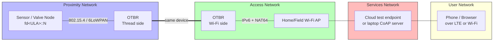

# Lab 5: Border Router — Bridging the Mesh to the Internet
> **Technical Guide:** [SOP-05: Border Router Deployment](sops/sop05_border_router.md) — RCP flash, OTBR bring-up, commissioning, troubleshooting.
> **Lecture:** [lab5_lecture.md](lectures/lab5_lecture.md)

**GreenField Technologies — SoilSense Project**

**Phase:** Integration

**Duration:** 3 hours

**ISO lens:** Enterprise system pattern (Table A.3, Figure A.5) + enterprise networking pattern (Table A.4, Figure A.6) — IoT gateway + the four networks (proximity / access / services / user)

---

## 1. Project Context

**From:** Daniela (Pilot Customer) via Product Team — *"I can check soil temperature in the field with my laptop, but I'm at the market and the dashboard on my phone is dead. The mesh is an island."*

You shipped efficient uplink in [Lab 3](lab3.md) (`/env/temp`, CoAP/CBOR + Observe) and reliable downlink in [Lab 4](lab4.md) (`/act/valve`, CON + SED). Both contracts live **inside the Thread mesh**. The phone, the cloud, the auditor's laptop — none of them speak 802.15.4. **Mission:** deploy an **OpenThread Border Router (OTBR)** that bridges the proximity network (Thread/6LoWPAN) to the access network (Wi-Fi/Ethernet) and onward to services and user networks. No new resource — same `/env/temp` and `/act/valve`, now reachable from outside.

| Stakeholder | Their question | How this lab answers |
|---|---|---|
| **Daniela (Farmer)** | Can I see this on my phone from the market? | The OTBR advertises a global IPv6 prefix to the mesh and NAT64-translates to the IPv4 internet. |
| **Edwin (Ops)** | If the cloud dies, does the field still work? | The mesh keeps operating; only off-mesh reach is lost. Local-first is structural, not optional. |
| **Samuel (Architect)** | Where does the boundary live and what does it cost? | One device, one diagram (Table A.4). You measure the per-hop latency it adds. |
| **ISO 30141 Auditor** | Which networks are chained, and what crosses the boundary? | You produce the §3 four-network walk for the DDR. |

---

## 2. ISO/IEC 30141 placement

**The lens just changed.** Labs 1–4 climbed the Functional viewpoint's domain ladder (PED → SCD → ASD). Today's primary artifacts are two paired patterns from Annex A of ISO/IEC 30141:2024:

- **§A.4 / Table A.3 / Figure A.5 — IoT enterprise system pattern** (the *system deployment model*): names the **IoT gateway** as an SCD entity that performs "protocol conversion, address mapping, data processing, information fusion, certification, and equipment management" — a one-line description of what an OTBR does. The OTBR is the canonical SoilSense IoT gateway.
- **§A.5 / Table A.4 / Figure A.6 — IoT enterprise networking pattern** (the *four networks* connecting those entities): proximity, access, services, user. The standard explicitly says the networking pattern *"uses"* the enterprise system pattern — they're designed as a pair.

The Border Router *is* the diagram those two tables draw together: an IoT gateway sitting on the boundary between the proximity network and the access network.

```mermaid
graph LR
    subgraph Prox [Proximity Network]
        Node[Sensor / Valve Node<br/>fd&lt;ULA&gt;::N]
        BRmesh[OTBR<br/>Thread side]
    end
    subgraph Access [Access Network]
        BRwifi[OTBR<br/>Wi-Fi side]
        AP[Home/Field Wi-Fi AP]
    end
    subgraph Services [Services Network]
        Cloud[Cloud test endpoint<br/>or laptop CoAP server]
    end
    subgraph User [User Network]
        Phone[Phone / Browser<br/>over LTE or Wi-Fi]
    end
    Node ---|802.15.4 / 6LoWPAN| BRmesh
    BRmesh ===|same device| BRwifi
    BRwifi ---|IPv6 + NAT64| AP
    AP --- Cloud
    Cloud --- Phone

    style Prox fill:#bbf,stroke:#333
    style Access fill:#bfb,stroke:#333
    style Services fill:#fbb,stroke:#333
    style User fill:#ffd,stroke:#333
```

**Four networks, one device at the seam.** The OTBR is a single physical device that has a foot in two of these networks (proximity and access). The other two (services, user) are downstream of the access network and outside your code, but the lab's deliverable is to show the chain.

**Quoting the standard.** Table A.3 (the enterprise system pattern) names the OTBR's job in exactly these words: *"IoT gateways are devices which connect SCD with other domains. IoT gateways provide functions such as protocol conversion, address mapping, data processing, information fusion, certification, and equipment management."* In Lab 5 you implement five of those six. **Protocol conversion** = none for CoAP (same bytes on both sides) but yes for IPv4 (NAT64); **address mapping** = the global prefix SLAAC + the NAT64 `64:ff9b::/96` translation; **data processing** = the OTBR forwards, it doesn't aggregate (that's Lab 7); **certification** = the OTBR's web-UI password and Thread commissioning trust anchor; **equipment management** = the OTBR web UI's topology + dataset management. The only one you skip is *information fusion* — a Lab 7 concern. Cite the exact quote in your DDR §4.

**Where the Functional domains still apply (briefly).** If you place this in the six-domain map (Figure A.5): the OTBR is an **SCD entity** — Figure A.5 explicitly draws the "IoT gateway" box inside the SCD, and the Table A.3 prose confirms it (*"IoT gateways are devices which connect SCD with other domains"*). It is *not* the RAID device. **RAID** (Resource Access & Interchange) is a separate domain that hosts the *access management component* and the *interchange subsystem* — the parts of the system that authenticate external consumers and expose ASD/OMD capabilities to them. In SoilSense, RAID will light up in Lab 6 (DTLS as access control) and Lab 7 (the dashboard's API surface), not here. Today the OTBR extends the SCD outward; it doesn't *become* RAID. Don't conflate the three structures: viewpoints (six) ≠ domains (six inside Functional) ≠ patterns (A.1–A.5).

**Functional / management plane separation (ISO §6.2.2.3.3):** the OTBR runs both planes side-by-side on one device. The **functional plane** forwards CoAP/UDP packets between proximity and access. The **management plane** advertises the global prefix to the mesh (SLAAC), advertises mesh routes to the Wi-Fi side (RA), and serves the OTBR web UI / commissioning. You can reconfigure commissioning in the UI without disturbing in-flight `coap put` traffic.

---

## 3. The networking-pattern artifact — four networks walked end-to-end

This is the artifact you cite in ADR-005 and add to your DDR §4 (ISO Mapping → enterprise networking pattern, Table A.4). It is the deliverable that replaces Lab 3/4's API contract — there is no new resource today, only a new path the existing ones can travel.

| Network (Table A.4 / Figure A.6) | What it is in SoilSense | Address you see | Crosses *into* the next network via |
|---|---|---|---|
| **Proximity** | Thread mesh from Lab 2; nodes from Lab 3/4 | mesh-local EID `fd<...>::N` | OTBR's 802.15.4 ↔ Wi-Fi/Ethernet bridge |
| **Access** | The OTBR + the Wi-Fi AP / Ethernet LAN it joins | OTBR global IPv6 + Wi-Fi local IPv4 | OTBR's NAT64 (`64:ff9b::/96`) and home router |
| **Services** | Cloud CoAP endpoint (or a local Python CoAP server on your laptop) | Public IPv4 / IPv6 | Cloud↔phone path; outside scope |
| **User** | Phone / browser viewing dashboard | Whatever the carrier hands out | — |

**Bytes-on-the-wire policy.** No new payload contract today — the `/env/temp` 6-byte CBOR and the `/act/valve` 4-byte CBOR cross **unchanged** across the boundary. The OTBR is a **network-layer** bridge, not an application-layer proxy. If the bytes change at the boundary, it's because you added a CoAP↔HTTP proxy on top — and that's a Lab 7 concern, not today's.

**Addressing rule for the lab.** Before the OTBR forms, your nodes only had **mesh-local** addresses (`fd<...>::N`, only valid inside the mesh). After the OTBR advertises a global prefix, every node gains a second IPv6 address with that prefix — that's the address an external client uses to reach it. `ipaddr` on a node will show **both**; `ipaddr mleid` returns the mesh-local one.

---

## 4. Execution

The Border Router is built from **two boards working as one device**: an ESP32-S3 (Wi-Fi-capable host) running the OTBR firmware, and an ESP32-C6 flashed as **RCP (Radio Co-Processor)** — a "dumb modem" that gives the S3 access to the 802.15.4 radio. SOP-05 walks the flash + bring-up; the ot_br example is the same one Espressif ships. **You author no C** — this lab is configuration and verification from the OTBR web UI and the Thread CLI. The Lab 2 mesh, the Lab 3 sensor server, and the Lab 4 valve server all stay running on their existing C6 boards.

### Task A — OTBR bring-up and mesh commissioning

- Flash the RCP firmware to one ESP32-C6 ([SOP-05 §1](sops/sop05_border_router.md#1-flash-the-radio-co-processor-rcp)).
- Flash the OTBR firmware to one ESP32-S3 with the RCP wired in ([SOP-05 §2](sops/sop05_border_router.md#2-flash-and-launch-the-otbr-host)).
- Bring up the OTBR's web UI on its Wi-Fi IP (port 80). Form a new Thread network from the UI (set a non-default PAN ID and network key, exactly as in [SOP-02](sops/sop02_6lowpan.md)).
- Re-commission your **Lab 3 Node A** (sensor) and **Lab 4 Node V** (valve) onto this OTBR-formed network by pasting the OTBR's `dataset active -x`.
- **Evidence:** OTBR web-UI topology screenshot showing OTBR + Node A + Node V; `state` output on each node showing they joined.

### Task B — Global prefix and the second address

- On the OTBR web UI, confirm a **global IPv6 prefix** is advertised (Espressif's ot_br defaults to enabling SLAAC; if not, enable "Prefix" in the UI with the `paros` flags).
- On Node A's CLI, run `ipaddr`. You should see at least **two** IPv6 addresses: the mesh-local `fd<...>::N` you've used since Lab 3, and a new one beginning with the global prefix.
- Save the global address — that's the one a client outside the mesh uses to reach `/env/temp`.
- **Evidence:** Node A `ipaddr` output annotated (which line is mesh-local, which is global); OTBR web-UI "Routes" panel showing the advertised prefix.

### Task C — End-to-end reach and the latency it costs (the headline number)

This is the trade-off the lab is built around. You measure how much latency the boundary adds, on the same `/env/temp` resource you've been hitting since Lab 3.

| Path | Where you run the client | Address you target | What you measure |
|---|---|---|---|
| **In-mesh baseline** | Node B's CLI (from Lab 3) | Node A's **mesh-local** `fd<...>::N` | `coap get` round-trip; this is your Lab 3 number, reproduce it |
| **Through the OTBR** | A Python CoAP client on your laptop (over Wi-Fi) | Node A's **global** address | Same `coap get`; the delta is the OTBR cost |
| **NAT64 to the IPv4 internet** | Node A's CLI | `ping 64:ff9b::8.8.8.8` (IPv6-encoded `8.8.8.8`) | Ping RTT; if it replies, your battery-powered sensor reached Google |

Use [tools/coap_client.py](../../tools/coap_client.py) for the laptop client — same script you ran in Lab 0.5 era, now pointed at the global address.

Fill the table below from your own measurements:

| Path | RTT (median of 10) | Δ vs in-mesh | Notes |
|---|---|---|---|
| In-mesh (Lab 3 reproduce) | ____ ms | 0 | baseline |
| Laptop → OTBR → Node A | ____ ms | +____ ms | the OTBR's added cost |
| Node A → NAT64 → 8.8.8.8 | ____ ms | n/a | IPv4 internet reachable from a 2×AA sensor? |

**Deliverable in your DDR:** the table above with all three rows filled in, plus one sentence stating the OTBR's measured added latency and whether it's acceptable for `/env/temp` (telemetry) vs `/act/valve` (actuation).

---

## 5. Deliverables — DDR updates

Update [your DDR](../3_deliverables_template.md):

- **§2 Lab Log → "Lab 5: Border Router" → To Daniela.** Two short paragraphs: can she see soil temperature from her phone via the cloud now, and how much latency the OTBR adds. Cite the Task C numbers.
- **§3 ADR-005: Single OTBR for SoilSense pilot.** Context (Daniela's market problem; Edwin's "cloud-down" worry), decision (one OTBR, no redundancy in the pilot, accept single-point-of-failure off-mesh), rationale (cite Task C numbers, the local-first property, cost), status. Note explicitly: when the OTBR dies, the mesh continues — `/act/valve` still works from a node B inside the field; only off-mesh reach is lost. Production deployments would add a second OTBR (covered in Lab 8).
- **§4 ISO Mapping.** Add two new sub-sections: **enterprise system pattern (Table A.3)** — quote the "IoT gateway" definition from the standard verbatim and list which of its named functions the OTBR provides in SoilSense (see §2 above; five of six); and **enterprise networking pattern (Table A.4)** — paste the §3 four-row table. In the domain map, tag the OTBR as an **SCD-hosted IoT gateway** (matching Figure A.5), *not* as RAID. Do not retitle the SCD and ASD entries from Labs 2–4 — they still describe what they described. **RAID stays gray** until Lab 6 / Lab 7.
- **§5 First Principles, Lab 5.** One sentence each: why a global IPv6 prefix is what makes the mesh routable from outside (it isn't a "gateway" magic, it's just SLAAC + a route); why NAT64 is needed even though Thread is IPv6 (most of the public internet isn't, yet); why the OTBR is two boards (the S3 has Wi-Fi but no 802.15.4 radio; the C6's radio is exposed as a spinel-over-UART RCP).
- **§6 Performance Baselines.** Fill in the "Lab 5: OTBR added latency" and "Lab 5: NAT64 RTT" rows from Task C — targets: OTBR overhead < 50 ms; NAT64 RTT < 200 ms over a typical home Wi-Fi.
- **§7 Ethics & Sustainability.** Sustainability: prove the local mesh survived an OTBR kill (`thread stop` on the S3 host, then re-run a `coap put` from Node B to Node V — it should still land). Security: the OTBR web UI must not be left on default credentials; set a password before the lab ends (the OTBR is now a Wi-Fi-exposed device, not a private CLI). Privacy: the global IPv6 prefix is *advertised on the Wi-Fi network* you're on — anyone on the same AP can route to your sensors. That's fine for the lab; flag it as a production concern (the answer is mesh-local firewalling on the OTBR + DTLS in Lab 6).
- **§8 Viewpoint Analysis (first real entry).** Lab 5 is the first lab where you write something in the §8 Viewpoint table beyond Functional. Add a row for the **enterprise system pattern** (entity-level view, Table A.3 / Figure A.5) and one for the **enterprise networking pattern** (network-level view, Table A.4 / Figure A.6). You'll fill more rows in Labs 6–8.

---

## Grading rubric (100 pts)

**Technical execution (40)** — OTBR + RCP brought up and web UI reachable (10) · Node A and Node V re-commissioned onto the OTBR-formed mesh, both gain global addresses (15) · Task C three-row latency table complete (15)

**ISO/IEC 30141 alignment (30)** — Table A.3 IoT-gateway quote + the five-of-six functions cited in DDR §4 (8) · Table A.4 four-network walk filled in DDR §4 (7) · OTBR placed correctly as an **SCD-hosted IoT gateway** (per Figure A.5) *and* as the proximity↔access bridge in the networking pattern — both lenses present, RAID not over-claimed (15)

**Analysis (20)** — ADR-005 justification with measured numbers, single-OTBR risk explicitly acknowledged (10) · Comparison of `/env/temp` latency in-mesh vs via OTBR, with one sentence per resource on whether the added latency is acceptable (10)

**Ethics (pass/fail)** — Sustainability: local mesh survives OTBR kill (demonstrated, not just claimed) · Security: OTBR web UI password changed from default · Privacy: global-prefix exposure on Wi-Fi flagged in DDR §7
