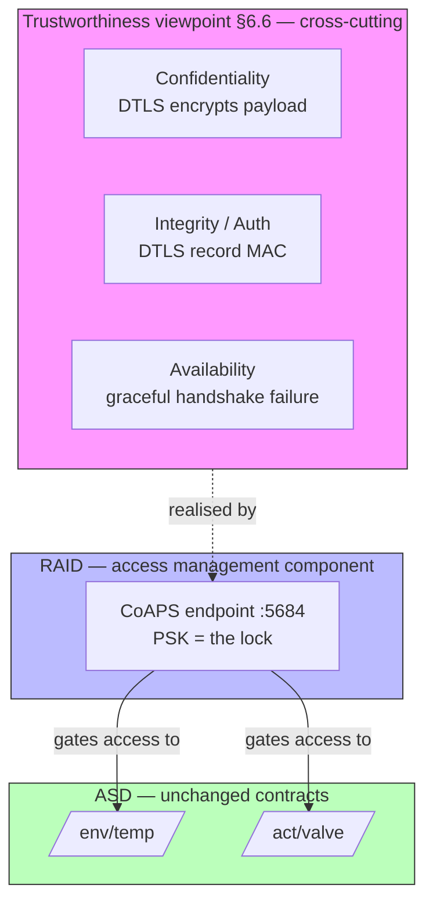

# Lab 6: Securing the Channel — DTLS & the Trustworthiness Viewpoint
> **Technical Guide:** [SOP-06: DTLS (CoAPS) & Secure OTA](sops/sop06_security_ota.md) — sdkconfig, PSK server paste, handshake timing, sniffer verification.
> **Lecture:** [lab6_lecture.md](lectures/lab6_lecture.md)

**GreenField Technologies — SoilSense Project**

**Phase:** Hardening

**Duration:** 3 hours

**ISO lens:** Trustworthiness viewpoint (§6.6) — a *cross-cutting* viewpoint, not a domain — landing on the RAID **access-management** function (Figure A.5)

---

## 1. Project Context

**From:** Edward (Security Lead) via the Pilot Farm pen-test — *"I parked 50 m from the greenhouse with a laptop. I read every soil-temperature value off the air, then injected a forged packet that told the valve to OPEN. Daniela's seedlings would have drowned. This is stop-ship."*

In [Lab 5](lab5.md) you made `/env/temp` and `/act/valve` reachable from outside the mesh through the OTBR. That solved Daniela's "my mesh is an island" problem — and opened a door: **anyone on the access network who knows the global address can read the sensor and command the valve.** The bytes cross the boundary in the clear. **Mission:** put a lock on the bytes. Upgrade the CoAP server to **CoAPS (DTLS over UDP, port 5684)** with a pre-shared key, prove an eavesdropper sees only ciphertext, prove a forged command is rejected, and measure what the handshake costs in time and energy.

| Stakeholder | Their question | How this lab answers |
|---|---|---|
| **Edward (Security)** | Can an attacker inject a fake "OPEN valve"? | DTLS authenticates every record; an unsigned packet is dropped before the handler runs. |
| **Daniela (Farmer)** | Is my farm data private on the air? | DTLS encrypts the CoAP payload; the sniffer sees "Encrypted Application Data," not `24.5 °C`. |
| **Edwin (Ops)** | What does the lock cost my batteries? | You measure the handshake (~6 flights) and pick a session-reuse policy so you don't re-handshake per reading. |
| **ISO 30141 Auditor** | Have you addressed Trustworthiness? | You produce the §6.6 seven-characteristic audit and place DTLS as the **RAID access-management** control. |

---

## 2. ISO/IEC 30141 placement

**The lens shifts again — and this time it isn't a place on the map.** Labs 1–4 climbed the Functional viewpoint's domain ladder (PED → SCD → ASD). Lab 5 pivoted to the Annex A pattern pair (enterprise system + networking). Today's lens is the **Trustworthiness viewpoint (§6.6)** — and the standard is explicit that trustworthiness is **cross-cutting**, applying across every domain rather than living in one box. You don't "add a Trustworthiness domain"; you audit the system you already built against seven named characteristics.



**RAID finally lights up.** Since Lab 1 the **RAID** domain (Resource Access & Interchange) has stayed gray on the board. Lab 5 deliberately kept it gray — the OTBR is an *SCD-hosted IoT gateway*, not RAID. Today RAID's **access-management component** (Figure A.5) is exactly what you implement: the PSK-gated CoAPS endpoint is the gate that decides who may exercise the ASD capabilities. The `/env/temp` and `/act/valve` contracts from Labs 3–4 **do not change** — same URIs, same CBOR. What changes is who is allowed to reach them, and whether the bytes are readable in flight. RAID's other half, the *interchange subsystem* (exposing capabilities to outside consumers), is a Lab 7 story.

**Functional / management plane separation (ISO §6.2.2.3.3):** DTLS lives on the **functional plane** — it protects application records as they flow. The PSK provisioning, identity, and (in production) key rotation are **management-plane** concerns. You can rotate the PSK on the management plane without changing a single line of the `/env/temp` handler on the functional plane — the separation is what makes "rotate keys without reflashing the app" a coherent goal.

---

## 3. The security contract — CoAPS on `/env/temp` and `/act/valve`

This is the artifact you cite in ADR-006 and add to your DDR §4. There is **no new resource** today — only a new transport binding and an access policy wrapped around the two contracts you already shipped.

| | |
|---|---|
| **Resources** | `/env/temp` (Lab 3), `/act/valve` (Lab 4) — unchanged URIs & CBOR |
| **Transport** | CoAP / DTLS / UDP / **port 5684** (CoAPS) — plain CoAP on 5683 is *disabled* |
| **DTLS version** | DTLS 1.2 (mbedTLS in ESP-IDF) |
| **Cipher suite** | `TLS_PSK_WITH_AES_128_CCM_8` — AEAD, 8-byte tag, the constrained-device default |
| **Authentication** | Pre-Shared Key. Identity = `soilsense-pilot`; key = lab PSK (in production: a per-device key in the Secure Element) |
| **Access policy** | A request whose record fails the DTLS MAC, or that arrives on plain 5683, never reaches the resource handler |
| **Session policy** | One DTLS session reused across many CoAP exchanges; handshake amortised, *not* paid per reading |

**What "encrypted" means on the wire:**

```
Plain CoAP (Lab 3):   [UDP][CoAP hdr][CBOR a16174f94e40]   ← "24.5 °C" readable
CoAPS  (today):       [UDP][DTLS record: ciphertext + MAC] ← opaque; sniffer shows
                                                              "Encrypted Application Data"
```

**The two security properties, stated precisely:**

- **Confidentiality** — the AES-128-CCM ciphertext hides the CBOR. A passive eavesdropper (Edward's laptop) learns packet *timing and size*, not *values*.
- **Integrity + authentication** — the CCM tag is a MAC keyed by the PSK. Flip one byte, or forge a whole record without the key, and the receiver's MAC check fails; the record is dropped **before** the CoAP layer sees it. This is what kills the forged "OPEN valve."

**Response behaviour:** a correctly-authenticated CoAPS client gets the same `2.05 Content` / `2.04 Changed` as before. A plain-CoAP client on 5683 gets **no response** (the port is closed). A CoAPS client with the wrong PSK fails the **handshake** — it never gets to send a request.

---

## 4. Execution

The firmware is provided in full — [SOP-06 Part A](sops/sop06_security_ota.md#part-a-dtls-implementation-coaps--the-graded-lab). You enable four `sdkconfig` lines, paste the PSK server changes into your **Lab 3 `/env/temp` server (Node A)**, rebuild, and reflash. The Lab 2 mesh, the Lab 4 valve, and (optionally) the Lab 5 OTBR all stay as they were. **You author no C beyond the PSK identity/key defines and one endpoint-init line** the SOP points to exactly. Evaluation is from Node B's CLI, a CoAPS client, and the 802.15.4 sniffer.

### Task A — The threat model (paper, before you touch code)

In your DDR, fill the **STRIDE table** for the scenario *"attacker with a laptop 50 m from the greenhouse."* Name at least three concrete threats and the control that addresses each ([SOP-06 §A.1](sops/sop06_security_ota.md#1-basic-threat-model) lists the asset/threat/control skeleton). At minimum: **Information Disclosure** (sniffing `/env/temp`), **Spoofing/Tampering** (the forged `/act/valve` PUT), **DoS** (handshake flooding). This table is what the rest of the lab tests.

### Task B — CoAPS up; plain CoAP locked out

- Enable DTLS in `sdkconfig` and flash the PSK server to Node A ([SOP-06 §A.2–§A.3](sops/sop06_security_ota.md#2-enable-dtls-in-libcoap)).
- **Negative test:** from a *plain* CoAP client, `coap get coap://[<Node A>]:5683/env/temp`. Expect **timeout / no response** — 5683 is closed.
- **Positive test:** from a CoAPS client with the right identity+key, `coaps://[<Node A>]:5684/env/temp`. Expect `2.05 Content` and the same 6-byte CBOR you decoded in Lab 3.
- **Auth-failure test:** repeat the CoAPS GET with the *wrong* key. Expect a **handshake failure**, not a `4.xx` — the request never forms.
- **Evidence:** three client logs (plain → timeout, correct PSK → 2.05, wrong PSK → handshake fail) + Node A server log showing PSK accept/reject.

### Task C — Prove it on the air + the handshake cost (the headline numbers)

Two measurements, both from the same flow.

**C.1 — Encryption on the wire.** Run the 802.15.4 sniffer while issuing one CoAPS GET. Confirm the payload shows as **"Encrypted Application Data"** — no plaintext `4e40` / `24.5`. Then (optional, satisfying) capture one *plain* CoAP reading first so you have the before/after side by side.

**C.2 — Handshake cost.** The DTLS handshake is ~6 flights of packets and is the dominant new energy term. Measure how long it takes, and confirm your session-reuse policy means you pay it **once per session**, not once per reading ([SOP-06 §A.5](sops/sop06_security_ota.md#5-performance-impact-analysis)).

Fill the table below from your own measurements:

| Measurement | Your number | Target | Notes |
|---|---|---|---|
| DTLS handshake time | ____ ms | < 3 s | first connect only |
| Plain CoAP reading exchange (Lab 3) | ____ B | baseline | from Lab 3 |
| CoAPS reading exchange (same payload, established session) | ____ B | — | DTLS record overhead per reading |
| Readings per handshake (your session policy) | ____ | as high as use allows | amortises the handshake energy |

Use ESP32-C6 RX current ≈ 75 mA; estimate the **extra radio-on time per handshake** (~200–300 ms) and convert to energy. Show the arithmetic.

**Deliverable in your DDR:** the table filled in, plus one sentence stating the per-handshake energy cost and why session reuse (not per-reading handshakes) is what makes DTLS affordable on a battery node.

> **Optional stretch — Secure OTA.** If you finish early, [SOP-06 Part B](sops/sop06_security_ota.md#part-b-secure-ota-updates-optional-stretch--not-graded) walks a signed v1→v2 update with MCUboot (image signing, signature verification on boot). It is **not graded** here — secure firmware update is a Lab 8 supplemental concern — but it pairs naturally with "who is allowed to change this device," so it lives in the SOP as a stretch goal.

---

## 5. Deliverables — DDR updates

Update [your DDR](../3_deliverables_template.md):

- **§2 Lab Log → "Lab 6: DTLS & Trustworthiness" → To Edward.** Two short paragraphs: can the attacker still sniff `/env/temp` or inject `/act/valve`, and what the handshake costs the battery. Cite the Task C numbers.
- **§3 ADR-006: PSK vs certificates for SoilSense DTLS.** Context (Edward's pen-test findings), decision (PSK for the pilot), rationale (flash size, no PKI to operate, handshake cost — cite Task C), status. State explicitly what PSK *gives up* versus certificates (no per-device revocation without rotating a shared key; identity is the key, not a signed chain) and what would force the move to certificates at fleet scale.
- **§4 ISO Mapping.** Add the **CoAPS security contract** (§3 table) as a RAID **access-management** entry. Note that `/env/temp` and `/act/valve` keep their ASD entries unchanged — only their *transport binding and access policy* changed. Do not retag the SCD/ASD/IoT-gateway entries from Labs 2–5. This is the lab where **RAID stops being gray.**
- **§5 First Principles, Lab 6.** One sentence each: why DTLS (not TLS) is the right fit for CoAP (UDP, no connection to hold open, handshake tolerant of reordering/loss); why an AEAD cipher gives confidentiality *and* integrity in one tag rather than encrypt-then-MAC by hand; why authentication — not encryption — is what stops the forged valve command (a sniffer reading ciphertext is a privacy loss; an injected command is a *safety* loss).
- **§6 Performance Baselines.** Fill in the "Lab 6: DTLS handshake time" row from Task C — target < 3 s — and note the per-reading byte overhead of the DTLS record vs plain CoAP.
- **§7 Ethics & Sustainability.** **Privacy:** state which SoilSense data qualifies as personal/operational and confirm it is now encrypted in transit (GDPR Art. 32, "security of processing"). **Safety:** the headline — authentication is what prevents an attacker drowning the greenhouse; tie it to the §6.6 *Safety* characteristic. **Sustainability:** a per-reading handshake would dominate the energy budget; document your session-reuse choice as the sustainability decision. **Transparency:** the PSK is hardcoded for the lab — say so, and say where it would live in production (Secure Element), so a stakeholder isn't misled about the pilot's real key hygiene.
- **§8 Viewpoint Analysis.** Fill the **Trustworthiness** row of the viewpoint table — Labs Addressed = "Lab 6," Key Concerns = end-to-end confidentiality + integrity of the CoAP application traffic via DTLS (cross-cutting per §6.6). This is your second non-Functional viewpoint entry after Lab 5's enterprise patterns.
- **§9 Trustworthiness Audit (Lab 6+).** This is the section's first real fill-in. Complete the seven-characteristic table (next section) — for each: Addressed? / How / Gaps. A documented gap is acceptable; an undocumented one is not. **DTLS is one measure, not the whole of trustworthiness** — note in the Gaps column the two characteristics DTLS leaves open and where they're closed later: *firmware integrity over the air* (signed DFU/OTA — the [SOP-06 Part B stretch](sops/sop06_security_ota.md#part-b-secure-ota-updates-optional-stretch--not-graded), realised in the dashboard labs) and *detection of compromise or node failure* (fleet anomaly-detection on `V_BATT`/`RSSI`/`uptime`/handshake-failure telemetry — the dashboard labs).

### The §9 Trustworthiness audit (ISO/IEC 30141 §6.6)

Walk every row of the DDR §9 table. A documented gap is acceptable; an undocumented one is not.

| Characteristic | Standard meaning | How DTLS addresses it | What to test / observe |
|---|---|---|---|
| **Availability** | System performs its function when required | Client recovers if a handshake fails mid-flight (retry, fall back to cached state) | Kill the server mid-handshake — does the client recover, or hang? |
| **Confidentiality** | Information not disclosed to unauthorised entities | AES-128-CCM encrypts the CoAP payload | Sniffer shows "Encrypted Application Data," not `4e40` (Task C.1) |
| **Integrity** | Data not altered in an unauthorised manner | DTLS record MAC (CCM tag) detects tampering | Flip a byte in a captured DTLS record — receiver rejects it |
| **Reliability** | Performs consistently under stated conditions | DTLS retransmits its own handshake flights over lossy Thread | Introduce loss during handshake — does it still complete? |
| **Resilience** | Withstands and recovers from adverse events | PSK rotation recovers from key compromise without reflashing the app | How fast can you rotate the PSK? (management-plane, §2) |
| **Safety** | No unacceptable risk of harm | Authentication rejects the forged "OPEN valve" before the handler runs | Send an unauthenticated PUT to `/act/valve` — confirm it's dropped |
| **Compliance** | Adherence to applicable law/regulation | Encryption-in-transit supports GDPR Art. 32 | Document which data is personal and confirm it's encrypted |

---

## Grading rubric (100 pts)

**Technical execution (40)** — CoAPS (DTLS/PSK) server on port 5684, plain 5683 closed (15) · Positive (correct PSK → 2.05) and auth-failure (wrong PSK → handshake fail) tests both shown (10) · Sniffer confirms payload is encrypted (15)

**ISO/IEC 30141 alignment (30)** — Trustworthiness §6.6 seven-characteristic audit complete, gaps documented (12) · STRIDE threat model with ≥3 concrete threats + controls (8) · DTLS placed correctly as the **RAID access-management** control, ASD contracts noted unchanged, RAID no longer gray (10)

**Analysis (20)** — ADR-006 PSK-vs-certificate justification with the trade-off named (10) · Handshake-time + session-reuse energy reasoning from Task C numbers (10)

**Ethics (pass/fail)** — Privacy: encryption-in-transit enabled and personal data identified · Safety: authentication-stops-forged-command demonstrated, not just claimed · Transparency: the hardcoded-PSK limitation documented for stakeholders
