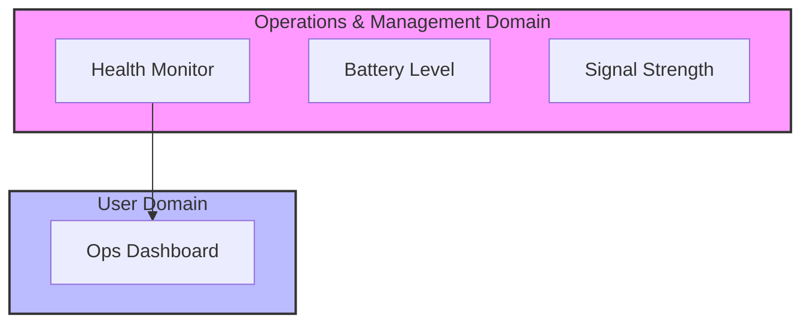

# Lab 7: Operations & Observability
> **Technical Guide:** [SOP-07: Telemetry & Dashboards](sops/sop07_telemetry.md)

**GreenField Technologies - SoilSense Project**
**Phase:** Operations (OMD)
**Duration:** 3 hours
**ISO Domains:** OMD (Operations & Management), UD (User)

---

## 1. Project Context

### Your Mission This Week

**From:** Edwin (Field Operations Lead)
**To:** Firmware Team
**Subject:** Stop flying blind

The security update (Lab 6) is working, but now we have a new problem.
Yesterday, Node #4 died. We don't know why.
* Did the battery run out?
* Did it crash?
* Is the signal too weak?

**We are flying blind.** I need a **Health Dashboard**.
Don't just send me "Soil Moisture." Send me "Battery Voltage", "RSSI", and "Uptime".

**Mission:** Implement the **OMD (Operations & Management)** domain logic.

— Edwin

### Stakeholders Counting On You

| Stakeholder | Their Question | How This Lab Helps |
|---|---|---|
| **Edwin (Ops)** | "Which nodes need battery replacement?" | You will report `V_BATT` telemetry. |
| **Daniela (Farmer)** | "Is the system working?" | You will build a simple "Green/Red" status light. |
| **ISO 30141 Auditor** | "How is the system maintained?" | You are implementing **OMD**. |

---

## ISO/IEC 30141 Context

### Visual Domain Mapping



---

## 2. Theory Preamble (15 min)
*Reference: [Theory Foundations](../5_theory_foundations.md) > Lab 7: Operations & Observability*

* **Telemetry vs. Business Data:**
    * *Business Data:* "Soil Moisture is 40%" (For Daniela).
    * *Telemetry:* "Battery is 3.1V, RSSI is -85dBm" (For Edwin).
* **The Cost of Observability:** Sending telemetry costs energy. Don't send it every second. Piggyback it on data packets or send it hourly.

---

## 3. Execution Tasks

### Task A: The Health Resource
Create `/sys/health`.
* **Payload (CBOR):**
    ```json
    {
      "batt": 3100,  // mV
      "rssi": -75,   // dBm
      "up": 3600     // Seconds since boot
    }
    ```

### Task B: The "Piggyback" Optimization
* **Problem:** Sending a separate packet for health wastes energy.
* **Solution:** Add the battery voltage as an "Option" or extra field in the main Temp/Humidity packet.
* **ADR:** Decide if you want separate packets (cleaner architecture) or piggybacking (energy efficient).

### Task C: The Dashboard
* **Tools:** Use ThingsBoard (or a simple Python script using `matplotlib`).
* **Goal:** Visualize "RSSI over Time".
* **Identify:** Spot when you walked away with the node (RSSI drop).

---

## 4. Deliverables (Update your DDR)

* **Dashboard Screenshot:** Show the Battery/RSSI graph.
* **ADR-007 (Telemetry Strategy):** How often do we report health?
* **ISO Domain Mapping:** Explain how this lab satisfies the **OMD** requirements.

---

## Grading Rubric (Total: 100 points)

### Technical Execution (40 points)
* [ ] Health resource `/sys/health` implemented (15 pts)
* [ ] Battery voltage and RSSI reading correct (10 pts)
* [ ] Dashboard visualization working (15 pts)

### ISO/IEC 30141 Alignment (30 points)
* [ ] OMD domain implementation (Telemetry) (15 pts)
* [ ] Distinction between Business Data and Telemetry explained (15 pts)

### Analysis (20 points)
* [ ] ADR-007 (Telemetry Strategy) justification (10 pts)
* [ ] Piggybacking vs Separate Packet trade-off analysis (10 pts)

### Ethics Checkpoint (Mandatory Pass/Fail)
* [ ] **Data Minimization**: Are we collecting only what is needed for operations?
* [ ] **Sustainability**: Did we optimize the reporting interval to save battery?
