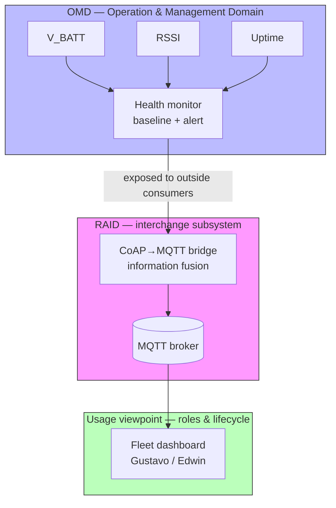

# Lab 7: Operations & Observability — Telemetry, the Dashboard & the Interchange Subsystem
> **Technical Guide:** [SOP-07: Telemetry, the Dashboard & the CoAP→MQTT Bridge](sops/sop07_telemetry.md) — the telemetry signals, extending the local dashboard, standing up a broker, the egress bridge.
> **Lecture:** [lab7_lecture.md](lectures/lab7_lecture.md)

**GreenField Technologies — SoilSense Project**

**Phase:** Operations

**Duration:** 3 hours

**ISO lens:** **OMD** (Operation & Management Domain — the telemetry signals) under the **Usage viewpoint** (§ usage — *who operates and watches*, roles and lifecycle, not topology). This is the lab where **RAID's interchange subsystem lights up** (Figure A.5) — the half of RAID that Lab 6 left gray.

---

## 1. Project Context

**From:** Edwin (Field Operations Lead) — *"Stop flying blind. Yesterday Node #4 went dark and I had no idea why. Battery? Crash? Did someone walk off with it? Right now the only way I can check a node is to sit next to it with a laptop and run `coap observe` by hand — one node, one terminal, and only if I'm inside the mesh. I can't do that for 200 sensors across three fields. I need the fleet on **one screen**: battery, signal, uptime, and a green light that turns red before a node dies — not after."*

In [Lab 5](lab5.md) you bridged the mesh to the internet through the OTBR, and in [Lab 6](lab6.md) you locked the channel with DTLS. But every reading still lives **inside the mesh** — the only consumer is whoever runs `coap observe` on Node B's CLI and tails it with the Flask dashboard from Lab 3. That's the **local-CLI** view: one node at a time, no fusion, nothing crosses the boundary. **Mission:** turn raw readings into **operational telemetry** (battery, RSSI, uptime — the OMD signals), put the fleet on a dashboard, and then make the data **leave the mesh** — publish it off-mesh to an MQTT broker so any authorized operator can see the whole fleet at once. That egress path is RAID's **interchange subsystem** — the "information fusion" that [Lab 5 explicitly deferred to this lab](lab5.md).

| Stakeholder | Their question | How this lab answers |
|---|---|---|
| **Edwin (Ops)** | Which nodes need a battery swap, and which went silent? | You report `V_BATT`/`uptime` and build a Green/Red status light + a silent-node check. |
| **Gustavo (Product)** | Is the fleet healthy at a glance? | You fuse every node into one dashboard fed off-mesh through the bridge. |
| **Daniela (Farmer)** | Is the system working? | The status light answers "yes/no" without her reading a single dBm. |
| **Edward (Security)** | Is anyone attacking us right now? | Failed-handshake-rate telemetry turns a Lab 6 security event into a *watchable* fleet signal. |
| **ISO 30141 Auditor** | How is the system operated and exposed? | You implement **OMD**, fill the **Usage** viewpoint, and light up **RAID interchange**. |

---

## 2. ISO/IEC 30141 placement

**The lens shifts a fourth time — and two things happen at once.** Labs 1–4 climbed the Functional domain ladder; Lab 5 used the Annex A pattern pair; Lab 6 audited the cross-cutting Trustworthiness viewpoint. Today you land on a **domain** and a **viewpoint** together: you implement the **Operation & Management Domain (OMD)** — the device-health telemetry an operator needs — and you read the system through the **Usage viewpoint**, whose question is *who operates and watches the system, in what roles, across what lifecycle* (Edwin and Gustavo, not topology). Don't conflate the two structures: OMD is a box on the Functional six-domain map; Usage is one of the six viewpoints laid over the whole system.


```mermaid
graph TD
    subgraph OMD [OMD — Operation & Management Domain]
        Batt[V_BATT]
        Rssi[RSSI]
        Up[Uptime]
        Health[Health monitor<br/>baseline + alert]
    end
    subgraph RAID [RAID — interchange subsystem]
        Bridge[CoAP→MQTT bridge<br/>information fusion]
        Broker[(MQTT broker)]
    end
    subgraph USAGE [Usage viewpoint — roles & lifecycle]
        Dash[Fleet dashboard<br/>Gustavo / Edwin]
    end
    Batt --> Health
    Rssi --> Health
    Up --> Health
    Health -->|exposed to outside consumers| Bridge
    Bridge --> Broker
    Broker --> Dash

    style OMD fill:#bbf,stroke:#333
    style RAID fill:#f9f,stroke:#333
    style USAGE fill:#bfb,stroke:#333
```

**RAID's other half lights up.** [Lab 6](lab6.md) lit RAID's **access-management** component (the PSK-gated CoAPS endpoint — *who may exercise a capability*). RAID's second half is the **interchange subsystem** — *exposing ASD/OMD capabilities to outside consumers and fusing their data*. That is exactly the CoAP→MQTT bridge you build today: it takes per-node CoAP/CBOR readings trapped inside the mesh and republishes them, fused, to a broker the outside world can subscribe to. [Lab 5 was careful](lab5.md) to keep this gray — it said the OTBR is an *SCD-hosted IoT gateway*, that "data processing" and "information fusion" were "a Lab 7 problem," and that we'd "come back" to putting a real broker on the access side. This is that lab. **The OTBR forwards bytes; the bridge fuses meaning.** They are different jobs at different layers.

**Functional / management-plane separation (ISO §6.2.2.3.3).** The telemetry stream itself rides the **functional plane** — it's application data flowing node → bridge → broker. The **operator's view** of that stream — the dashboard, the thresholds, the alert rules, who is allowed to watch — is a **management-plane** concern. You can change a battery alert threshold or add a subscriber without touching a single line of the `/env/temp` handler. The separation is what lets Ops tune the dashboard while the fleet keeps reporting undisturbed.

---

## 3. The telemetry contract — and what "interchange" means on the wire

This is the artifact you cite in ADR-007 and add to your DDR §4. Two things are new: the **OMD payload** (the health signals) and the **egress path** (how those signals leave the mesh).

**Business data vs telemetry — two audiences, one packet.**

| | Business data | Telemetry (OMD) |
|---|---|---|
| Example | `t = 24.5 °C` (soil temp) | `batt = 3100 mV`, `rssi = -75 dBm`, `up = 3600 s` |
| For whom | Daniela (the farmer) | Edwin / Gustavo (operations) |
| Question it answers | "Is my soil OK?" | "Is the *node* OK?" |
| Reporting policy | Every reading | **Piggybacked** or **on an interval** — telemetry costs energy, so don't stream it every second |

| | OMD telemetry payload |
|---|---|
| **Signals** | `batt` (mV), `rssi` (dBm), `up` (seconds since boot) |
| **Encoding** | CBOR map, same wire format as the Lab 3 `/env/temp` contract |
| **Delivery** | **Option 1 — piggyback:** add the three keys to the existing `/env/temp` map (one packet, energy-efficient). **Option 2 — separate `/sys/health` resource:** a clean, independently-observable resource (more packets). **ADR-007 decides.** |
| **Report interval** | Far slower than business data — battery and uptime drift over hours, not seconds. Tune for energy (the Lab 4 poll-period lesson, again). |

**The two paths — local CLI vs off-mesh egress.** This is the heart of the lab. The same readings can be consumed two completely different ways:

```
LOCAL-CLI PATH (what you already have — the "before"):
   Node B  ──`coap observe`──►  Node B CLI log  ──tail──►  Flask dashboard
   └─ inside the Thread mesh ─────────────────────────────┘
   One node at a time. No fusion. Nothing crosses the OTBR boundary.

OFF-MESH EGRESS PATH (the new, graded work — the "after" = RAID interchange):
   Node ──CoAP Observe (CBOR)──►  CoAP→MQTT bridge  ──MQTT publish (JSON)──►  Broker  ──►  any subscriber
   └─ proximity net (CoAP/CBOR/IPv6) ─┘  └─ the translator ─┘  └─ access net (MQTT/JSON/IPv4) ─────────────┘
   The whole fleet, fused, on one topic. Data has LEFT the mesh.
```

The bridge is the **interchange subsystem**: it terminates CoAP/CBOR/IPv6 on the mesh side and re-emits MQTT/JSON on the access side. The destination broker is **swappable** — a local Mosquitto on your laptop (the no-pain default) or AWS IoT Core out on the real internet (the same bytes, crossing the NAT64 path you proved in [Lab 5](lab5.md)). The transferable skill is the bridge; the broker is a config line.

---

## 4. Execution

You provide the firmware additions (the SOP gives them in full) and run the dashboard + bridge tooling that already lives in [`tools/`](../../tools/). Evaluation is from the dashboard, `mosquitto_sub`, and your own measurements.

### Task A — The telemetry signals + ADR-007 (firmware + paper)

- Add the three OMD signals to your Lab 6 Node A: `rssi` (`otPlatRadioGetRssi`), `up` (`esp_timer_get_time()`), `batt` (ADC oneshot read, or a documented mock — [SOP-07 Part A](sops/sop07_telemetry.md#part-a--the-telemetry-signals-firmware)).
- **Decide ADR-007:** piggyback the three keys onto `/env/temp` (one packet, energy-efficient) **or** expose a separate `/sys/health` resource (clean, independently observable). Justify against the energy cost and the operational need.
- **Evidence:** a CoAP read showing the extended CBOR map (or `/sys/health` returning the three signals).

### Task B — The local dashboard (the "before")

- Extend [`tools/dashboard_coap.py`](../../tools/dashboard_coap.py) to decode `batt`/`rssi`/`up` and add three Chart.js panels, a **Green/Red status light** (Green if `batt > 3000 mV` **and** `rssi > -90 dBm` **and** last-seen `< 60 s`; Red otherwise), and a **multi-node fleet table** ([SOP-07 Part B](sops/sop07_telemetry.md#part-b--the-local-dashboard-extend-dashboard_coappy)).
- **Walk test:** run the dashboard, pick up a node, walk away from the OTBR. Watch RSSI drop and the light flip to Red. Note the RSSI at which the Observe stream stops updating.
- **Evidence:** a screenshot of the fleet table + the RSSI graph showing the walk.

### Task C — The interchange move: data leaves the mesh (the headline)

This is the graded centerpiece. Contrast it directly with Task B: there, you were *inside* the mesh tailing one CLI; here, the data is **published off-mesh** and fused.

- Stand up a **local Mosquitto** broker — one apt/brew/docker line ([SOP-07 Part C](sops/sop07_telemetry.md#part-c--the-interchange-the-coapmqtt-bridge)).
- Run the **CoAP→MQTT bridge**: it subscribes to each node's CoAP Observe, decodes the CBOR, and publishes JSON to `soilsense/<node>/telemetry`.
- Subscribe two ways: `mosquitto_sub -t 'soilsense/#'` (raw proof the fused stream exists) and [`tools/dashboard_mqtt.py`](../../tools/dashboard_mqtt.py) (the operator view, reused from Lab 0.5).
- **State the boundary explicitly** in your DDR: inside the mesh the node speaks CoAP/CBOR/IPv6; outside, the broker speaks MQTT/JSON/IPv4; the bridge is the translator — Table A.3 *information fusion*, RAID interchange.
- **Evidence:** `mosquitto_sub` output showing ≥2 nodes on the fused topic + the MQTT dashboard screenshot.

Fill the measurements table from your own runs:

| Measurement | Your number | Notes |
|---|---|---|
| Telemetry byte overhead — piggyback (`/env/temp` + 3 keys) | ____ B | vs the 6-byte Lab 3 payload |
| Telemetry byte overhead — separate `/sys/health` | ____ B | the cost of a clean resource |
| Report interval you chose | ____ s | justify against battery (Task A) |
| End-to-end latency: node → bridge → broker → dashboard | ____ ms | the price of fusion |

### Stretch (extra credit, not required) — send it to the *actual* internet

- Point the **same bridge** at **AWS IoT Core** (MQTT over TLS, port 8883, an X.509 Thing certificate) instead of localhost Mosquitto ([SOP-07 Part D](sops/sop07_telemetry.md#part-d-optional-stretch--aws-iot-core-the-real-internet)). The only change is the broker endpoint + TLS creds. Your bytes now traverse NAT64 to the public internet — the path you already proved works in [Lab 5](lab5.md).
- **Pillar-2 preview:** the same egress path is how a fleet later *receives* a managed signed-OTA push (Lab 6's pillar 2). You don't build it here — that lands in [Lab 8](lab8.md) — but note where it plugs in.

---

## 5. Deliverables — DDR updates

Update [your DDR](../3_deliverables_template.md):

- **§2 Lab Log → "Lab 7: Dashboard" → To Gustavo (Product).** Two short paragraphs: can Gustavo now see the whole fleet's health at a glance, and how the data gets from a battery sensor in the field to his screen (name the bridge and the broker). Cite the Task C latency.
- **§3 ADR-007: Telemetry strategy + broker choice.** Context (Edwin's "flying blind"), decision (piggyback vs `/sys/health`; report interval), rationale (energy cost from Task A; operational need). Add a short second decision on the **broker**: local Mosquitto for the pilot, AWS IoT Core as the production option, and state the invariant — *the CoAP→MQTT bridge is the architecture; the broker is a swappable endpoint.* Note why a heavyweight cloud platform isn't required for the pilot (it can't ingest CoAP/CBOR/IPv6 natively, so you'd build the same bridge anyway).
- **§4 ISO Mapping.** Add the **OMD telemetry signals** (batt/rssi/uptime, the health monitor) to the domain table, and add the **CoAP→MQTT bridge** as a **RAID interchange-subsystem** entry — Table A.3 *information fusion*. Note that RAID's **access-management** entry from Lab 6 is **unchanged**, and that the OTBR stays an **SCD-hosted IoT gateway** (Lab 5) — do not retag it as RAID. **This is the lab where RAID's interchange half stops being gray.**
- **§5 First Principles, Lab 7.** One sentence each: why telemetry is not business data (different audience, different cadence, different cost); why a broker on the access side beats trying to make every phone reach every node over end-to-end IPv6 (fan-out, NAT64/464XLAT, the [Lab 5 lecture hook](lectures/lab5_lecture.md)); why the **bridge** — not the cloud account — is the real architecture (the destination is a config line).
- **§6 Performance Baselines.** Add a "Lab 7: telemetry report interval / egress latency" row — record the node→broker→dashboard latency and your chosen report interval.
- **§7 Ethics & Sustainability.** **Data minimization:** collect only what Ops needs (batt/rssi/uptime) — name anything you deliberately did *not* report. **Sustainability:** justify the report interval as the energy decision (a per-second telemetry stream would dominate the Lab 3/4 budget). **Transparency:** the data now *leaves the device* — say where it goes (which broker, on whose machine, who can subscribe), so a stakeholder isn't misled about where SoilSense's data lives.
- **§8 Viewpoint Analysis.** Fill the **Usage** viewpoint row — Labs Addressed = "Lab 7," Key Concerns = operator roles (Edwin/Gustavo), fleet-health visibility, and lifecycle (a node's silent → alert → battery-swap loop). This is your third non-Functional viewpoint entry after Lab 5 and Lab 6.
- **§9 Trustworthiness Audit — close a Lab 6 gap.** [Lab 6 wrote](lab6.md) a documented gap: *"detection of compromise / node failure — not addressed by DTLS or DFU; realised in the dashboard labs."* That gap **closes here.** Update the audit: the telemetry + baseline + alert loop now gives you *detection* (silent-node check, low-battery alert, failed-handshake-rate as an attack signal). Note what remains for [Lab 8](lab8.md): *managed* response (pushing a signed OTA fix to the fleet — pillar 2).

> **Forward hook — Lab 8 (the Golden Master).** Detection without response is half a system. [Lab 8](lab8.md) is the capstone: the chaos test (kill the OTBR, jam Wi-Fi, flood the mesh, reboot nodes) and the *managed* side of operations — pushing a signed firmware update to the fleet over the egress path you built today. Today you watch the fleet; next time you act on it.

---

## Grading rubric (100 pts)

**Technical execution (40)** — OMD telemetry signals (batt/rssi/uptime) read and reported correctly (10) · Local dashboard extended with the Green/Red status light **and** a multi-node fleet table, walk-test shown (15) · CoAP→MQTT egress working: data leaves the mesh, a subscriber sees the fused multi-node stream (15)

**ISO/IEC 30141 alignment (30)** — OMD telemetry mapping in §4 (10) · Usage viewpoint row filled in §8 (10) · RAID **interchange subsystem** placed correctly — not conflated with Lab 6's access-management, not with the OTBR-as-SCD; access-management noted unchanged; RAID interchange no longer gray (10)

**Analysis (20)** — ADR-007 telemetry strategy (piggyback vs `/sys/health` + report interval) justified (10) · Local-CLI-vs-internet-egress trade-off articulated, broker choice (Mosquitto-vs-cloud) reasoned with "bridge is the invariant" (10)

**Ethics (pass/fail)** — Data minimization: only ops-needed telemetry collected, omissions named · Sustainability: report interval defended as the energy decision · Transparency: where the data goes once it leaves the device is documented
