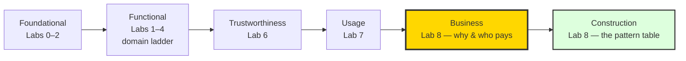

# Lab 8: The Golden Master — Consolidation, the Chaos Script & the Business Case
> **Technical Guide:** [SOP-08: The Golden Master](sops/sop08_consolidation.md) — release hardening, the fail-safe valve, rate limiting, the chaos drills, the e2e suite + mini pentest.
> **Lecture:** [lab8_lecture.md](lectures/lab8_lecture.md)

**GreenField Technologies — SoilSense Project**

**Phase:** Production Release

**Duration:** 2 weeks (final sprint)

**ISO lens:** the **Business viewpoint** (§6.3 — *why does this system exist, and who pays for it*), the last of the six viewpoints to become dominant — re-answered with evidence instead of week-1 speculation. Paired with the **Construction viewpoint** (§6.7 — the IoT System Pattern, the one-page record of what you actually built). The six-viewpoint DDR closes here.

---

## 1. Project Context

**From:** Samuel (Senior Architect) — *"This is it. The pilot deployment is Monday and the contract has a go/no-go gate. I take your binary, flash it to three nodes, and run the **chaos script**: cut power to the Border Router, jam the Wi-Fi, flood the network with requests, reboot nodes at random. If the system recovers by itself, we ship. If I have to press a reset button even once, we fail the pilot — because in the field that button-press is a **truck roll**, and truck rolls are what kill a service business. No new features this sprint. Bring me the Golden Master."*

Labs 1–7 built the system: the mesh, the CoAP contract, the SED valve, the Border Router, DTLS, and the fleet dashboard. **Mission:** freeze it into **`soilsense_v1.bin`** — a release build with no secrets in the repo, a rate-limited server, a valve that **fails closed**, and proven hands-off recovery under the chaos drills — then close the DDR: re-answer the [week-1 Business Viewpoint exercise](../1_project_scenario.md#8b-business-viewpoint-exercise-isoiec-30141-section-63) with evidence, and fill the Construction-viewpoint IoT System Pattern from the running system.

| Stakeholder | Their question | How this lab answers |
|---|---|---|
| **Samuel (Architect)** | Does it survive the chaos script with zero intervention? | You run all six chaos drills yourself, hands off, and record the recovery numbers. |
| **Gustavo (Product)** | Is the pilot a go — and does this architecture sell a *service*, not boxes? | The re-answered Business viewpoint: OTA is the warranty, telemetry is the SLA, auto-recovery is the truck-roll math. |
| **Edwin (Ops)** | Will I be rolling trucks? | Auto-recovery, rate limiting, and a fail-safe valve — every drill he doesn't have to drive out for. |
| **Edward (Security)** | Did the hardening survive integration? | The mini pentest: wrong-dataset join, wrong-PSK handshake, malformed actuation — all rejected, all *visible* on the Lab 7 telemetry. |
| **Daniela (Farmer)** | If GreenField disappears in 5 years, does my farm keep watering? | The blackout drill proves local-first; open protocols (Thread/CoAP) are her exit clause — the §7 ethics reflection. |
| **ISO 30141 Auditor** | Are all six viewpoints addressed? | DDR §8 complete — the Business row at last — plus the §10 IoT System Pattern. |

---

## 2. ISO/IEC 30141 placement

**The lens shifts one last time — and the tour completes.** Labs 1–4 climbed the Functional domain ladder; Lab 5 used the Annex A pattern pair; Lab 6 audited Trustworthiness; Lab 7 landed on Usage. One viewpoint was never made dominant: **Business**. The standard lists it *second* — in industry the *why* comes before the *how* — and the course saved it for *last*, on purpose: in week 1 you answered the §8b exercise with speculation; today you answer it with a working mesh, measured battery life, a fleet dashboard, and a binary that survives the chaos script. The Business viewpoint stopped being creative writing and became an **audit**.

| Lab | Question being held | Lens |
|---|---|---|
| 1–4 | "Where in the stack are we adding code?" | Functional → domain ladder (PED→SCD→ASD) |
| 5 | "How many networks does a packet cross?" | Annex A pattern pair |
| 6 | "Can we trust the system end-to-end?" | Trustworthiness viewpoint |
| 7 | "Who operates and watches the fleet?" | Usage viewpoint + OMD + RAID interchange |
| **8** | **"Why does this system exist — and who pays for it?"** | **Business viewpoint** + **Construction view** |



**The Construction viewpoint: the IoT System Pattern (Table 12).** ISO/IEC 30141 §6.7 is the standard's way of saying *"show me what you built and how the pieces fit."* Fill the pattern table below from the system you actually flashed — it becomes DDR §10, the single page an architect hands a reviewer. If a row is empty, that's a finding: either you didn't build it, or you didn't document it.

| Pattern Element | Category | Your SoilSense Implementation |
|---|---|---|
| **IoT System** | — | SoilSense v1.0 |
| **IoT Components** | Physical entities | _e.g., 3× sensor nodes, 1× Border Router, 1× dashboard host_ |
| **Digital Network** | Connectivity | _e.g., Thread mesh (802.15.4) + Wi-Fi/Ethernet backhaul_ |
| **IoT Devices** | Hardware | _e.g., ESP32-C6 with temperature transducer; SED valve node_ |
| **Primary Capability** | Physical observation | _What does the system observe?_ |
| **Primary Capability** | Control of entities | _What does it actuate?_ |
| **Secondary Capability** | Data processing | _e.g., CBOR encoding, threshold alerting, telemetry baseline_ |
| **Secondary Capability** | Data transferring | _e.g., CoAP/CoAPS over Thread; CoAP→MQTT bridge egress_ |
| **Secondary Capability** | Data storage | _e.g., dashboard in-memory fleet state; broker retained values_ |
| **Interface** | Network | _e.g., IEEE 802.15.4 (Thread), Wi-Fi (802.11)_ |
| **Interface** | Human UI | _e.g., fleet dashboard, Green/Red status light_ |
| **Interface** | Application | _e.g., `/env/temp`, `/act/valve`, `/sys/health`, `soilsense/+/telemetry`_ |
| **Supplemental** | Security | _e.g., DTLS/PSK (CoAPS :5684), Thread network key, rate limiting_ |
| **Supplemental** | Orchestration | _e.g., Thread leader election, mesh self-healing, SED polling_ |
| **Supplemental** | Management | _e.g., OMD telemetry, OTA path (pillar 2), version in boot log_ |

---

## 3. The Golden Master contract — what "production-ready" means

This is the artifact Samuel grades against, and the table you cite in your DDR. "Golden Master" is a **set of invariants**, not a feeling:

| Invariant | Meaning | Proven by |
|---|---|---|
| **Recovers from cold start** | Full power loss → mesh re-forms, dashboard green, **< 2 min** | Drill 1 |
| **Survives backhaul loss** | OTBR dead 10 min → mesh keeps working (local-first), everything recovers when it returns | Drill 2 |
| **Fails safe** | Valve node loses every parent → valve **closes itself** (water on the crop is the dangerous state) | Drill 3 |
| **Survives a flood** | Request burst → 4.29 Too Many Requests, no reboot, dashboard keeps updating | Drill 4 + e2e suite |
| **Survives reboots** | Random power cycles → every node rejoins, uptime resets visible on telemetry | Drill 5 |
| **Runs unattended** | ≥ 12 h soak, 0 crashes, no memory creep | Drill 6 |
| **Carries no secrets in the repo** | PSK and network key live in a gitignored header, not in git | Part A audit |

The business reading of this table (the [lecture's](lectures/lab8_lecture.md) point): every invariant that fails in the field is a **truck roll** — and the chaos script is six months of field reality compressed into an afternoon. "Recovers automatically" *is* the economics of the pilot.

---

## 4. Execution

No new features — Lab 8 adds **robustness to what exists**. The SOP gives every firmware addition in full; the test tooling lives in [`tools/`](../../tools/).

### Task A — Harden the build

- Switch both firmware projects to a release configuration (size optimization, stack canaries, task watchdog verified on) and stamp the version: the boot log must read `SoilSense Golden Master v1.0.0` ([SOP-08 Part A](sops/sop08_consolidation.md#part-a--harden-the-build)).
- **Get the secrets out of the repo:** the Lab 6 PSK pair (and the Thread network key if you committed it) move to a gitignored `secrets.h`; commit a `secrets.h.example` with placeholders.
- **Evidence:** the version line in the boot log; `git grep secretkey` returning only the `.example` placeholder.

### Task B — Harden the actuation path

- Add **rate limiting** to Node A's handlers — a per-source window that answers **4.29 Too Many Requests** when a peer floods ([SOP-08 Part B.1](sops/sop08_consolidation.md#b1--rate-limiting-on-node-a-429-too-many-requests)).
- Add the **fail-safe** to the valve node: detached from every parent for 30 s with the valve open → it closes itself ([SOP-08 Part B.2](sops/sop08_consolidation.md#b2--the-fail-safe-valve-fail-closed)).
- **Decide ADR-008:** should the actuation path itself be secured beyond Thread's link-layer encryption — DTLS on a battery SED (handshake energy, Lab 6 numbers), gateway-enforced policy, or documented acceptance? There is no free option; that's why it's an ADR ([SOP-08 Part B.3](sops/sop08_consolidation.md#b3--adr-008-securing-the-actuation-path)).
- **Evidence:** a captured 4.29 under burst; the `FAILSAFE` log line + valve closing with no command.

### Task C — The chaos drills + the e2e suite (the headline)

This is the graded centerpiece: **prove recovery, hands off.** Run the six drills from [SOP-08 Part C](sops/sop08_consolidation.md#part-c--the-chaos-drills-self-audit-before-samuels-script), watching only the CLI and the Lab 7 dashboard. Then run the automated suite from your laptop — off-mesh, so every passing test also re-proves the Lab 5 OTBR path:

```bash
python tools/test_e2e.py <node_a_global_ipv6> [valve_global_ipv6]
```

Fill the measurements table from your own runs:

| Measurement | Your number | Notes |
|---|---|---|
| Cold-start network formation (drill 1) | ____ s | target < 120 s |
| Blackout recovery — OTBR back → dashboard green (drill 2) | ____ s | mesh must have stayed up meanwhile |
| Fail-safe trigger after losing all parents (drill 3) | ____ s | ≈ the 30 s detach window |
| Stress: success ratio / avg latency (suite) | ____ % / ____ ms | ≥ 80% to pass |
| Burst: requests before first 4.29 (suite) | ____ | your rate-limit window, observed |
| Overnight soak: hours / crashes (drill 6) | ____ h / ____ | must be ____ / 0 |

- **Mini pentest** (Edward's sign-off): wrong-dataset join stays `detached`; wrong-PSK handshake fails *and lights the Lab 7 failed-handshake telemetry*; malformed valve payload gets 4.00 ([SOP-08 Part D.2](sops/sop08_consolidation.md#d2--manual-pentest-items)).
- **Evidence:** the suite's printed report (success ratio + latency stats) and the drill numbers above.

### Task D — Close the DDR: the business case + the pattern table

- **Re-answer the [week-1 Business Viewpoint exercise](../1_project_scenario.md#8b-business-viewpoint-exercise-isoiec-30141-section-63)** — the same three §6.3/Table 3 concerns, 200–300 words, but now **every claim cites the built system**: a lab, a measurement, an ADR. (Value captured at the decision point, not the sensor; as-a-service = OTA + telemetry + SLA, which you built; characteristics priced with the truck-roll arithmetic from the lecture.)
- **Fill DDR §8 completely** — including the Business row that has sat empty since week 1 — and **complete the §10 IoT System Pattern table** (Section 2 above) from the flashed system.
- Record the **2-minute demo video**: network formation, dashboard updating, one chaos drill recovering hands-off, and the fail-safe valve closing.

### Stretch (extra credit, not required) — Pillar 2: the managed signed OTA

[Lab 6](lab6.md) previewed *signed code* (pillar 2); [Lab 7](lab7.md) built the egress path and promised that "watching becomes acting." Close the loop: sign a v1.1.0 image (MCUboot + `imgtool`, [SOP-06 Part B](sops/sop06_security_ota.md#part-b-secure-ota-updates-optional-stretch--not-graded)), serve it with [`tools/ota_server.py`](../../tools/ota_server.py), announce it over the broker, and watch the Lab 7 dashboard report the new version — a *managed* update pushed down the same path the telemetry comes up ([SOP-08 Part E](sops/sop08_consolidation.md#part-e-optional-stretch--pillar-2-the-managed-signed-ota)).

---

## 5. Deliverables — DDR final version

Update [your DDR](../3_deliverables_template.md) one last time:

- **§2 Lab Log → "Lab 8: Final Integration" → To Samuel.** Two short paragraphs: the chaos-drill results with numbers, and the go/no-go recommendation you would make for the pilot — argued like an architect, not a student.
- **§3 ADR-008: Hardening the Golden Master.** Context (the pilot gate), decisions (actuation-path security: DTLS-on-SED vs link-layer-only vs gateway policy; secrets handling: gitignored header now, NVS/secure element in production), rationale with the Lab 6 handshake-energy numbers.
- **§4 ISO Mapping — final sweep.** Every component placed, nothing retagged wrongly (the OTBR is still an SCD-hosted gateway; the bridge is still RAID interchange). This table should now describe the whole system with no gray boxes.
- **§5 First Principles, Lab 8.** One sentence each: why the valve **fails closed** (the dangerous state is water flowing, not water stopped); why availability is a *business* property (every non-recovery is a truck roll); why "no new features" is a feature (every line added in week 8 is a line untested in week 9).
- **§6 Performance Baselines.** Add the final rows: cold-start formation time, blackout recovery time, stress success ratio/latency, overnight uptime.
- **§7 Ethics & Sustainability — the final assessment.** Complete the checklist (data inventory: exactly what SoilSense collects and where it goes; Daniela can access and delete her data; retention defined; devices repurposable; OTA extends lifespan rather than planned obsolescence; open protocols prevent lock-in). Then answer the four reflection questions in writing:
  1. If GreenField shuts down in 5 years, will Daniela's sensors still work? How? *(Cite the blackout drill and the open-protocol stack.)*
  2. What data could you stop collecting without losing core functionality?
  3. Who benefits from this system? Who might be disadvantaged?
  4. What would you do differently if you rebuilt it with ethics as a day-one requirement?
- **§8 Viewpoint Analysis — all six rows filled.** The headline is the **Business row**: paste in (or reference) your re-answered §8b exercise. This is the row that has been empty since week 1; filling it with evidence is the point of the final lecture.
- **§9 Trustworthiness Audit — final.** Close what closed (detection via Lab 7; channel via Lab 6; rate limiting and fail-safe today — availability and safety rows). Be honest about pillar 2: *done* if you did the stretch, otherwise a *documented gap with a plan* — an auditor respects a named gap and distrusts a blank one.
- **§10 Construction Viewpoint.** The completed IoT System Pattern table, matching the binary you submitted — not the system you meant to build.

**The final package:** ① `soilsense_v1.bin` (the Golden Master) · ② DDR final version (§1–§10 complete) · ③ the e2e suite report (success ratio, latency stats) · ④ the 2-minute demo video.

> **Closing.** You've built a complete IoT system and analyzed it through **all six ISO/IEC 30141 viewpoints** — and you know the six functional domains are one diagram inside one of them. The difference between an engineer and an architect: the engineer can tell you how it works; the architect can also tell you why it's worth building. *Congratulations — you are now both.*

---

## Grading rubric (100 pts)

**Technical execution (40)** — Chaos drills: hands-off recovery, all six, with recorded numbers (20) · Hardening shown working: release build + version stamp, secrets out of the repo, 4.29 under burst, fail-safe valve closing on parent loss (10) · e2e suite ≥ 80% stress success + the 2-minute demo video (10)

**ISO/IEC 30141 alignment (30)** — §8 Viewpoint Analysis: all six rows, with the **Business row** re-answered in 200–300 words where every claim cites a lab, a measurement, or an ADR (10) · §10 IoT System Pattern complete and matching the flashed system (10) · §4/§9 final sweep correct: no retagged components, pillar-2 status honest (10)

**Analysis (20)** — ADR-008 reasoned with numbers (actuation-path security; secrets handling) (10) · Measurements interpreted in business terms: recovery numbers → truck-roll economics, the go/no-go argued (10)

**Ethics (pass/fail)** — The four §7 reflection questions answered thoughtfully · Fail-safe verified: failure modes fail *closed* · Data inventory + deletion path documented — would you let your family use this system?
